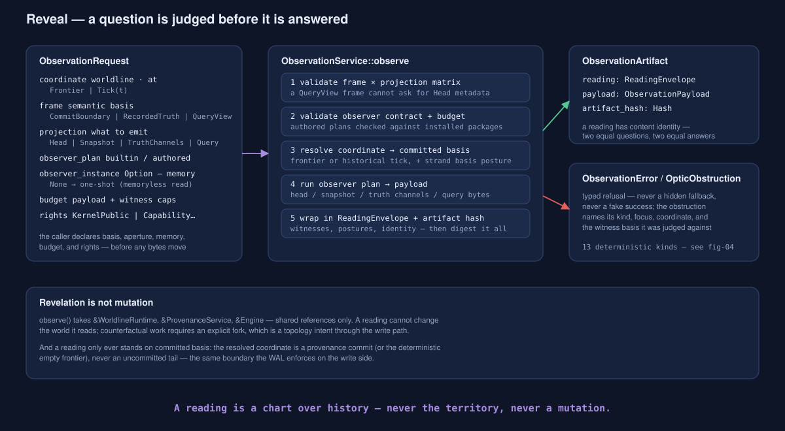
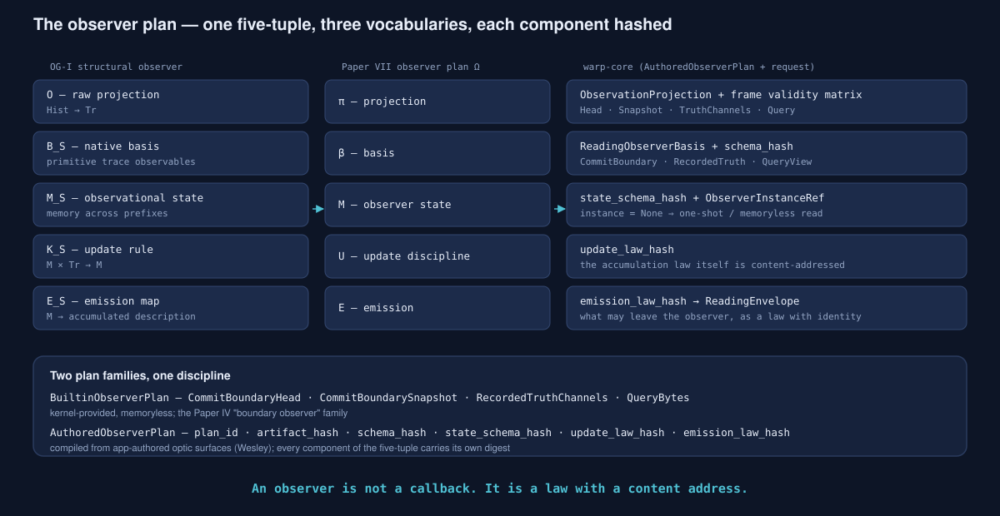
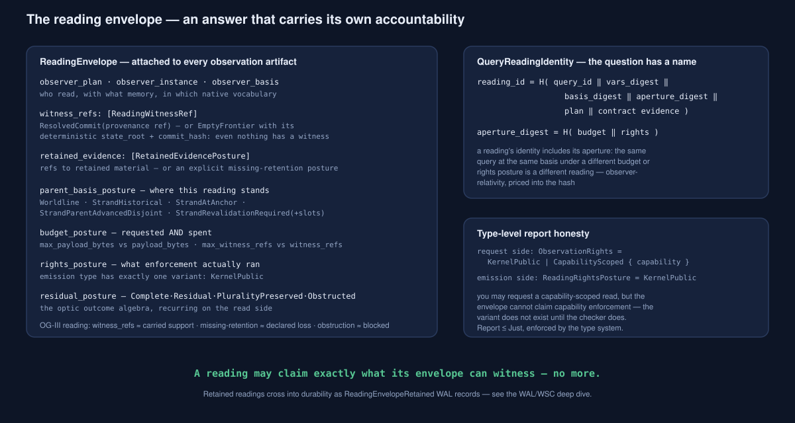
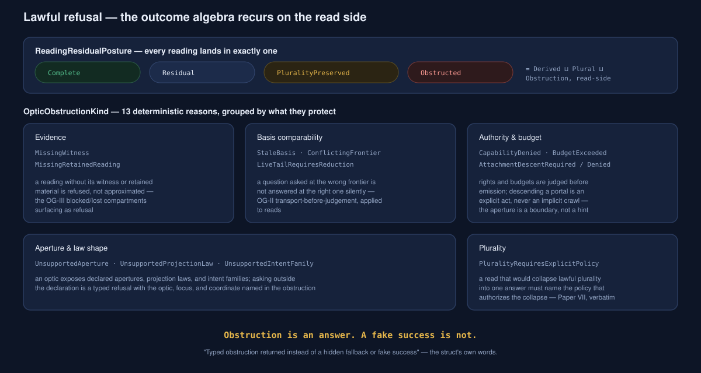

<!-- SPDX-License-Identifier: Apache-2.0 OR LicenseRef-MIND-UCAL-1.0 -->
<!-- © James Ross Ω FLYING•ROBOTS <https://github.com/flyingrobots> -->

# Optics and Revelation — How Echo Is Seen

> ```text
> The SuperTick decides. The WAL remembers.
> The optic is how anyone is allowed to look.
> ```

This is the deep dive into Echo's read side: observation, observer plans,
readings, and lawful refusal. It completes the trilogy —
[The SuperTick](../supertick/README.md) covers _Commitment_,
[The Causal WAL and WSC](../wal-wsc/README.md) covers durability and
_Folding_, and this document covers _Revelation_: the third moment of the
architecture, where admitted history is exposed to a bounded observer under an
aperture and authority regime. The sharpest insights land in
[the WoahMan ledger](../WOAHMAN.md).

| Layer               | Source                                         | What it is                                                        |
| ------------------- | ---------------------------------------------- | ----------------------------------------------------------------- |
| Observation surface | `crates/warp-core/src/observation.rs`          | Requests, observer plans, reading envelopes, the observe pipeline |
| Optic surface       | `crates/warp-core/src/optic.rs`                | Optic readings, dispatch requests, typed obstructions             |
| Host boundary       | `crates/warp-core/src/trusted_runtime_host.rs` | `observe()` — the only read door applications get                 |



## 1. The theory shelf (vocabulary, not evidence)

This document's behavioral claims rest on source code (§8). But its
_vocabulary_ comes from four papers, and naming the lineage makes the code
legible:

- **AIΩN Paper IV** defines observers as _resource-bounded functors_ from
  history to trace spaces — without budgets, every observer collapses into
  "replay everything." It gives the boundary/bulk/semantic taxonomy and
  rulial distance (the asymmetric cost of translating one observer's view
  into another's).
- **AIΩN Paper VII** defines the WARP optic `Ψ = (Ω, χ, ρ, Π, Λ)` and the
  three moments — Commitment, Folding, Revelation — with the observer plan
  `Ω = (π, β, M, U, E)` as the revelation-side face.
- **Observer Geometry I** defines the structural observer
  `S = (O, B_S, M_S, K_S, E_S)` — projection, native basis, memory, update
  rule, emission — and proves observer comparison cannot collapse to a
  scalar. Note that Ω and S are the _same five-tuple_ in two notations.
- **Observer Geometry III** defines the support ledger (carried /
  declared-lost / blocked / refuting), justified status versus emitted
  report, and **witness debt**: emitting a report stronger than the evidence
  carries.

The rest of this document shows each of these landing in `warp-core` as
concrete types — and flags exactly where the landing is still partial.

## 2. The question you are allowed to ask

Everything starts with `ObservationRequest`. It is not a query string; it is
a declaration of _how the caller intends to look_, judged before any bytes
move:

```text
ObservationRequest {
    coordinate,          // which worldline, at Frontier or Tick(t)
    frame,               // semantic basis: CommitBoundary | RecordedTruth | QueryView
    projection,          // Head | Snapshot | TruthChannels{filter} | Query{id, vars}
    observer_plan,       // builtin or authored — WHO is reading (§3)
    observer_instance,   // Option — accumulated observer state; None ⇒ one-shot
    budget,              // UnboundedOneShot | Bounded{max_payload_bytes, max_witness_refs}
    rights,              // KernelPublic | CapabilityScoped{capability}
}
```

Three design facts carry most of the weight:

1. **Frame × projection is a validity matrix.** A `QueryView` frame cannot
   request `Head` metadata; the service validates the pair before anything
   runs (`validate_frame_projection`). Basis and projection are separate
   axes, exactly as OG-I demands.
2. **Memory is opt-in and explicit.** `observer_instance: None` is a
   one-shot, memoryless read — Paper IV's budgeted-functor observer.
   `Some(instance)` invokes hosted accumulated observer state — OG-I's
   accumulation layer. The memoryless case being the _default_ mirrors
   OG-I's remark that WARP IV observers are the memoryless special case.
3. **Budgets are Paper IV's (τ,m), made concrete.** `Bounded` caps the
   encoded payload bytes and the number of witness references the caller
   will accept. A reading that cannot fit is not truncated silently — it is
   judged (§6).

## 3. Observer plans — a law with a content address



Echo ships four **builtin plans** (`CommitBoundaryHead`,
`CommitBoundarySnapshot`, `RecordedTruthChannels`, `QueryBytes`) — kernel
public, memoryless, the "boundary observer" family. The interesting object is
the **authored plan**:

```text
AuthoredObserverPlan {
    plan_id,             // stable identity
    artifact_hash,       // the compiled observer artifact
    schema_hash,         // the authored schema / contract family  (basis, β)
    state_schema_hash,   // the observer's memory shape            (M)
    update_law_hash,     // the accumulation law                   (U / K_S)
    emission_law_hash,   // what may leave the observer            (E)
}
```

Read that against OG-I's `S = (O, B_S, M_S, K_S, E_S)`: every component of
the five-tuple carries **its own digest**. An observer in Echo is not a
callback registered at runtime — it is a _law with a content address_,
compiled from an app-authored optic surface (the Wesley seam described in
Paper VII §Application Boundary), and validated against the installed
contract package before it is allowed to read
(`validate_observer_contract`). Changing an observer's update law changes
its identity, which changes the identity of every reading it emits (§5).

## 4. Where the reading stands — basis postures

A reading must say what basis it was resolved against, and the
`ObservationBasisPosture` enum is OG-II's comparability discipline applied to
reads. Beyond plain `Worldline`, the strand-aware variants distinguish, with
increasing tension:

| Posture                        | Meaning                                                                                                  |
| ------------------------------ | -------------------------------------------------------------------------------------------------------- |
| `StrandHistorical`             | Historical coordinate on a live strand's child worldline                                                 |
| `StrandAtAnchor`               | Strand frontier read; parent still at the fork anchor                                                    |
| `StrandParentAdvancedDisjoint` | Parent moved, but outside the strand-owned footprint — carries `parent_from`/`parent_to` provenance refs |
| `StrandRevalidationRequired`   | Parent moved **inside** the owned footprint — carries the overlapping slots                              |

The last variant is the one to stare at: whether a strand read is still
honest after parent movement is decided by **footprint overlap** — the same
warp-scoped slot machinery the reserve gate uses on the write side. One
conflict model, both directions.

## 5. The reading envelope — an answer that carries its accountability



Every artifact carries a `ReadingEnvelope`, and the envelope is where OG-III
stops being theory. It records who read (`observer_plan`, `observer_instance`,
`observer_basis`), and then four accountability surfaces:

- **`witness_refs`** — the commits that witness the reading. Even the empty
  case is witnessed: `ReadingWitnessRef::EmptyFrontier` carries the
  deterministic empty-frontier `state_root` and `commit_hash`. _Nothing_ has
  a name here.
- **`retained_evidence`** — references to retained material, or an explicit
  missing-retention posture. Declared loss, not silent loss.
- **Postures** — `parent_basis_posture` (§4), `budget_posture` (which
  records _requested and spent_: `max_payload_bytes` next to
  `payload_bytes`, `max_witness_refs` next to `witness_refs` — budget
  accounting witnessed inside the artifact), `rights_posture`, and
  `residual_posture` (§6).

And the reading has _identity_. For query reads, `QueryReadingIdentity`
digests the question — query id, vars, **basis digest, aperture digest**
(`H(budget ‖ rights)`), plan, and contract evidence — into a stable
`reading_id`. The consequence is observer relativity priced into the hash:
the same query at the same basis under a different budget or rights posture
is a _different reading_. Two observers cannot accidentally launder one
chart into another.

## 6. Lawful refusal — the outcome algebra recurs



Paper VII's outcome algebra
(`Derived ⊔ Plural ⊔ Conflict ⊔ Obstruction`) recurs on the read side as
`ReadingResidualPosture`:

```text
Complete | Residual | PluralityPreserved | Obstructed
```

`Residual` deserves a note: it is the profunctor-optics residual `M` made
into a first-class posture — the observer emitted a bounded reading and
_says explicitly_ that lawful content remains outside the payload.
`PluralityPreserved` is Paper VII's "plurality is a lawful outcome," emitted
rather than collapsed.

When a reading cannot lawfully proceed at all, the optic path returns an
`OpticObstruction` — in the struct's own words, _"returned instead of a
hidden fallback or fake success"_ — with one of thirteen deterministic kinds.
Grouped by what they protect: **evidence** (`MissingWitness`,
`MissingRetainedReading`), **basis comparability** (`StaleBasis`,
`ConflictingFrontier`, `LiveTailRequiresReduction` — a live-tail read must be
reduced "before it is honest"), **authority and budget** (`CapabilityDenied`,
`BudgetExceeded`, `AttachmentDescentRequired`/`Denied` — descending a portal
is an explicit act, never an implicit crawl), **aperture and law shape**
(`UnsupportedAperture`/`ProjectionLaw`/`IntentFamily`), and **plurality**
(`PluralityRequiresExplicitPolicy` — collapsing plurality requires naming
the policy that authorizes it).

## 7. One authored surface, two faces

The same optic that serves readings also carries the write side:
`DispatchOpticIntentRequest` names an optic, a base coordinate, an intent
family, a focus, a cause, a capability, and an admission law — and its
validation refuses stale bases and conflicting frontiers _before_ dispatch
(`validate_proposal_against_current`). This is Paper VII's application
boundary realized: one authored optic compiles into write-side intents and
read-side observer plans over the same generic runtime, and both faces are
judged against the same coordinate discipline.

Readings can also cross into durability: an `OpticReading` may carry a
`retained: Option<RetainedReadingKey>`, and retained readings are exactly
what the WAL records as `ReadingEnvelopeRetained` inside retained-reading
transactions — with `WalRedactionPosture` (`Present` / `DigestOnly` /
`RetainedRef` / `Encrypted` / `RedactedByPolicy`) governing what of the
payload persists at which fidelity. The read side and the durability spine
meet in one record family, and the DIND convergence gate holds all paths to
the same bounded reading.

## 8. Report ≤ Just — witness debt, structurally zero

OG-III defines witness debt as emitting a report stronger than the carried
support justifies. Echo's read side is built so that the load-bearing cases
of that failure are _unrepresentable_:

1. **Readings stand only on committed basis.** Coordinate resolution targets
   provenance commits (or the deterministic empty frontier) — never an
   uncommitted tail. The write side's "no visible outcome without committed
   history" and the read side's witness discipline are the same boundary.
2. **Rights honesty is type-level.** The request side offers
   `ObservationRights::CapabilityScoped`, but the emission side —
   `ReadingRightsPosture` — has exactly one variant: `KernelPublic`. Until a
   capability checker exists, the envelope _cannot claim_ capability
   enforcement, because the claim has no representation. This is the honest
   half of a feature in progress, and the honesty is enforced by the
   compiler.
3. **Budget honesty is recorded.** The budget posture carries requested and
   spent side by side; an over-budget read is an obstruction, not a trim.
4. **Loss is declared.** Missing retention is a typed posture in
   `retained_evidence`, not an absent field.

```text
The doctrine "Echo may only claim what its WAL can recover" is support
soundness — Report ≤ Just — applied to durability. The reading envelope
is the same law applied to revelation.
```

## 9. The invariants, in one place

1. **Revelation is not mutation.** `observe` takes shared references;
   counterfactuals require an explicit fork through the write path.
2. **The question is judged before it is answered** — frame×projection
   validity, contract validation, budget validation, coordinate resolution,
   in that order.
3. **An observer is a law with a content address** — five components, five
   digests; changing the law changes every downstream reading identity.
4. **Memory is opt-in and named.** One-shot reads are memoryless by
   construction; accumulation requires a hosted instance reference.
5. **A reading's identity includes its aperture.** Basis digest and
   aperture digest (`budget ‖ rights`) are inside `reading_id`.
6. **Every reading names its witness — even the empty frontier.**
7. **The outcome algebra recurs on the read side.** Complete / Residual /
   PluralityPreserved / Obstructed; plurality collapse requires explicit
   policy.
8. **Obstruction is an answer.** Thirteen deterministic kinds; no hidden
   fallback, no fake success.
9. **Report ≤ Just, structurally.** Rights the system doesn't enforce
   cannot be claimed; budgets are witnessed; loss is declared.
10. **One authored optic, two faces.** Write-side dispatch and read-side
    plans share coordinates, footprint discipline, and refusal vocabulary.

## 10. Evidence standard

Behavioral claims were verified against source code at commit `f94acd4b`,
per the project rule (source code only; comments and papers ground
vocabulary, never behavior):

- **Request anatomy, frames, projections** —
  `observation.rs#L106-L257@f94acd4b` (`ObservationAt`, `ObservationFrame`,
  `ObservationProjection`, `ObservationRequest`).
- **Authored plan component hashes** — `observation.rs#L436-L462@f94acd4b`
  (`schema_hash`, `state_schema_hash`, `update_law_hash`,
  `emission_law_hash` fields read directly).
- **Basis postures incl. footprint-overlap revalidation** —
  `observation.rs#L338-L408@f94acd4b`.
- **Budget/rights/witness/residual postures and envelope fields** —
  `observation.rs#L664-L941@f94acd4b`; the emission-side
  `ReadingRightsPosture` single variant at `#L814-L825`; requested-vs-spent
  budget posture at `#L777-L810`; `QueryReadingIdentity` digests at
  `#L857-L881`.
- **Observe pipeline order** — method list of `ObservationService`
  (`observation.rs#L1266-L2444@f94acd4b`): `validate_frame_projection`,
  `validate_observer_contract`, `resolve_coordinate`, `reading_envelope`,
  `compute_artifact_hash`, `query_basis_digest`,
  `query_aperture_digest(budget, rights)`.
- **Optic reading, dispatch request, obstruction kinds** —
  `optic.rs#L1240-L1420@f94acd4b` (all 13 `OpticObstructionKind` variants,
  `OpticReading.retained`, `validate_proposal_against_current`).
- **Signature-level (inferred, high confidence)** — "revelation is not
  mutation" rests on `observe(&WorldlineRuntime, &ProvenanceService,
&Engine, …)` taking shared references; interior mutability was not
  exhaustively ruled out.
- **Comment-derived, flagged** — the note that `CapabilityScoped` is
  "carried but not executed" appears in a doc comment
  (`observation.rs#L719-L721`); the _type-level_ claim (emission variant
  absent) is code-verified and stands on its own.

Line numbers drift; the cited commit is the anchor. Re-derive before
relying.

## 11. Source map

| Where                                                                        | What                                                           |
| ---------------------------------------------------------------------------- | -------------------------------------------------------------- |
| `crates/warp-core/src/observation.rs`                                        | Requests, plans, postures, envelopes, the observe pipeline     |
| `crates/warp-core/src/optic.rs`                                              | Optic ids/foci, readings, dispatch, obstructions, capabilities |
| `crates/warp-core/src/retained_evidence.rs`                                  | Retained evidence coordinates, roles, postures                 |
| `crates/warp-core/src/revelation.rs`                                         | Authority domains and origins for revelation                   |
| `crates/warp-core/src/trusted_runtime_host.rs`                               | `observe()` — the application-facing read door                 |
| `docs/topics/wal-wsc/README.md`                                              | Where retained readings become durable                         |
| `docs/topics/supertick/README.md`                                            | The write side these readings observe                          |
| `~/git/blog/aion-paper-07` · `~/git/aion-paper-04` · `~/git/aion-og-{1,2,3}` | The theory shelf (vocabulary)                                  |

> ```text
> Slice, lower, witness, retain — then, and only then, reveal.
> ```
