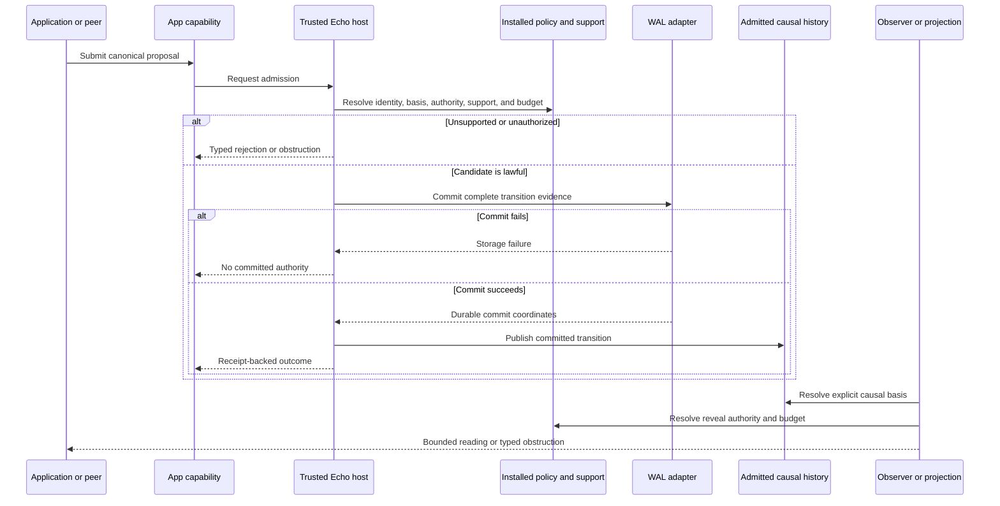

<!-- SPDX-License-Identifier: Apache-2.0 OR LicenseRef-MIND-UCAL-1.0 -->
<!-- © James Ross Ω FLYING•ROBOTS <https://github.com/flyingrobots> -->

# Security And Authority Boundaries

Echo's most important security discipline is to avoid making an artifact prove
more than it binds. This document is the proposition ledger for common Echo
objects and mechanisms.

## The Seven Separate Questions

Every security-sensitive operation must answer these questions independently:

1. **Identity:** Are these the exact canonical bytes or semantic coordinates
   named by this identifier?
2. **Integrity:** Have the bytes or coordinates changed relative to a trusted
   digest or root?
3. **Authenticity:** Which principal, host, peer, artifact, or authority produced
   the claim?
4. **Authorization:** May that principal perform this operation at this basis,
   scope, subject, and time?
5. **Confidentiality:** May this observer learn these bytes or this fact?
6. **Durability and freshness:** Will the committed evidence survive recovery,
   and is it the latest accepted basis rather than a valid old prefix?
7. **Availability:** Are the required bytes, indexes, keys, policies, and
   computation available within budget?

One successful answer does not imply another. BLAKE3 identity does not answer
who authored the bytes. Authorization does not guarantee the CAS blob still
exists. WAL durability does not grant reveal permission.

## Authority Flow



Applications never cross the authority boundary by constructing the output
value locally. They cross it only through an Echo-owned transition whose
support and durable evidence can be validated.

## Proposition Ledger

| Artifact or mechanism | Proposition it can support | What it does not prove |
| --------------------- | -------------------------- | ---------------------- |
| Canonical bytes | The value has one deterministic encoding under the named schema and version. | Validity under current policy, admission, authenticity, authorization, confidentiality, or availability. |
| Domain-separated BLAKE3 digest | The canonical bytes match the named digest domain, assuming collision resistance. | Who created the bytes, whether they are lawful, whether they are secret, or whether they are current. |
| Header or frame checksum | Accidental corruption is detectable relative to the checksum algorithm. | Adversarial authenticity or tamper resistance. |
| Content-addressed CAS id | Retrieved bytes match the addressed content hash. | Semantic coordinate, causal authority, retention, reveal permission, or future availability. |
| WSC payload | A deterministic physical representation can be decoded and validated under its profile. | Causal admission, WAL commit, recovery authority, or application meaning. |
| Storage locator or file path | A host suggests where bytes may be found. | Identity, integrity, durability, authority, or causal meaning. |
| Application proposal | A caller requested a specific operation against supplied coordinates. | Echo acceptance, eligibility, execution, or success. |
| Admission ticket or fact | Echo admitted the exact claim under the bound basis and policy. | Application execution, domain success, reveal permission, or material availability. |
| Tick receipt | Echo committed the exact scheduler-owned outcome and evidence named by the receipt. | That a copied receipt value came from trusted recovery, or that unrelated operations are authorized. |
| Causal parent reference | The child cites a specific admitted parent event. | Undo, redo, compensation, or any other domain semantics not supplied by the application contract. |
| Causal-anchor claim | A canonical caller claim binds a subject, supplied basis, roots, purpose, and schema. | Echo admission, root existence, root authority, retention pinning, or domain checkpoint validity. |
| Admitted causal anchor | Echo committed the exact claim at its current logical basis under the bound support-policy digest. | Physical retention, materialization availability, application-domain validity, or text mutation. |
| Capability presentation | A caller cites a grant identity in a presentation shape. | That the grant exists, is authentic, is unexpired, covers the artifact/operation/scope, or authorizes the current request. |
| Validated capability grant | The named grant covers the validated identity requirements under the evaluated policy posture. | Runtime support, scheduler work, law execution, unlimited aperture, or automatic reveal of retained material. |
| Reading envelope | Echo reports the basis, observer plan, aperture, budget, rights, residual, and evidence posture for a reading. | Causal mutation authority or permission to widen the reading. |
| Proof opening | The named commitment proposition verified for the named coordinates under the named proof system. | Capability, admission, scheduler, WAL, recovery, or reveal authority. |
| Graph or hologram materialization | A derived view was computed from a named basis and support set. | Substrate truth, freshness at another basis, or validity for another observer. |
| Projection-cache hit | A cached artifact matches the complete cache key and coverage contract. | That an incomplete key is safe, that the observer is equivalent, or that source authority remains available. |
| WAL frame | A record claims a typed payload and coordinate with integrity metadata. | A committed transaction when viewed alone. |
| WAL commit marker | The complete transaction validated and crossed the adapter's commit boundary. | Confidentiality, remote freshness, application authorization, or protection from a compromised adapter. |
| Recovery certificate | Echo derived a named recovery posture and index root from a committed replay range. | That omitted external retained material is available or that the store is not a valid old prefix. |
| Obstruction fact | Echo could not lawfully produce the requested result under the named posture and evidence. | Permanent impossibility, authorization for retry, or application success. |

## Caller Claim Versus Echo Evidence

The following construction pattern is forbidden:

```text
caller computes the same hash
-> caller fills an authority-looking struct
-> adapter labels it Echo-produced
-> downstream code trusts it
```

Matching a public golden vector proves only algorithm compatibility. It does not
transfer Echo authority to the reimplementation.

The lawful pattern is:

```text
caller constructs canonical proposal
-> trusted Echo host validates current basis and policy
-> Echo derives authority identities
-> complete transition commits through the WAL
-> app receives opaque committed evidence
-> later use recovers or validates the support chain
```

Applications may translate opaque identities into their own wire DTOs. They
must copy those identities exactly, preserve source posture, and never
recompute an Echo-owned authority domain in another language.

## Cryptographic Posture

### Canonicalization and domain separation

Echo uses canonical encoding and distinct digest domains to prevent two
different semantic values from acquiring the same identity merely because
their payload bytes happen to match. Length prefixes, versions, enum codes,
roles, ordering, and semantic coordinates must be included wherever the
identity contract requires them.

Canonicalization is necessary for deterministic identity. It is not validation
under current policy. A perfectly canonical unauthorized request remains
unauthorized.

### BLAKE3

Current identities predominantly use unkeyed BLAKE3. The security claim is
collision-resistant and preimage-resistant content commitment under the named
domain. It is not a signature or message-authentication code.

Consequences:

- a digest mismatch detects alteration relative to a trusted expected digest;
- a digest match does not identify an author or trusted process;
- an attacker who can replace both bytes and every trusted root may present a
  self-consistent false universe;
- low-entropy secrets must not be protected by plain `hash(secret)` because a
  dictionary attacker can test guesses; and
- cryptographic agility or a primitive migration requires explicit versioned
  identity contracts and compatibility evidence.

### Checksums

WAL header and frame checksums are corruption detectors. They help localize
torn or damaged records. They must never be described as adversarial
authentication. The cryptographic digest and trusted-root chain serve a
different purpose, and neither replaces authorization.

### Signatures and MACs

The current local causal-anchor and trusted-runtime WAL paths do not establish a
general signature or MAC boundary for application proposals, WAL frames, or
peer bundles. A deployment that needs cross-host authenticity must bind a
principal or participant identity, key id, signature algorithm, canonical
signed bytes, verification policy, revocation posture, and replay domain into
its admission profile.

Transport encryption or TLS can protect a channel. It does not replace Echo's
semantic admission checks.

## Durability And Freshness

### Commit boundary

For a WAL-backed operation, the transition becomes durable when the adapter
commits the complete transaction. Candidate state must not be published as
committed authority before that boundary. On commit failure, Echo returns no
committed outcome and restores or discards tentative process state.

The in-memory WAL cannot support process-restart durability. It is appropriate
for tests and explicit ephemeral profiles. A filesystem or remote adapter must
prove its own atomicity, flush, crash, reopen, and corruption behavior.

### Recovery

Recovery proceeds from committed WAL evidence, then rebuilds projections and
indexes. A projection update failure after commit marks the projection stale or
obstructed; it must not roll back causal history. Disposable indexes may be
rebuilt. Missing authoritative evidence cannot be repaired by trusting a cache.

### Freshness and rollback

Hash chains establish internal consistency relative to a trusted chain head.
They do not establish that the supplied head is the newest one. A deployment
that must detect valid-prefix rollback needs an external freshness authority.
Candidate mechanisms include an independently retained anchor, signed
transparency service, quorum, hardware monotonic counter, or operator-held
root. The chosen mechanism becomes part of that deployment's trusted computing
base.

## Authorization And Capability

Authorization is a decision over at least:

- authenticated subject or principal;
- authority domain and issuer;
- installed artifact and operation identity;
- causal basis and target subject;
- scope and requested effect;
- expiry, revocation, or delegation posture;
- aperture and disclosure class for reads;
- resource budget; and
- current host policy and runtime support.

A capability presentation is caller input. Echo must resolve it against
host-supported grant evidence and policy. Unknown, malformed, unbound, expired,
or mismatched grants obstruct. A valid grant cannot invent a missing handler,
codec, observer, law, retained blob, scheduler opportunity, or budget.

The current capability and optic machinery is partial. The narrow grant
validator does not parse expiry bytes; it can obstruct an explicitly supplied
expired posture, while the default validation trait uses `NotEvaluated`.
Trusted clock, revocation, delegation, and quorum policy are not established by
that check. The lower-level raw observation path and current high-level bridge
must not be advertised as a complete product authorization boundary until
trusted capability and law binding is end to end.

## Confidentiality, Revelation, And Erasure

Confidentiality requires more than a content hash or redaction flag. A complete
profile needs:

- data classification before persistence;
- encryption with authenticated ciphertext where appropriate;
- key generation, storage, rotation, revocation, backup, and destruction;
- capability- and policy-bound revelation;
- observer-safe cache partitioning;
- metadata and access-pattern analysis;
- explicit retention and deletion semantics; and
- witnesses proving plaintext does not enter forbidden stores or logs.

Current WAL transaction builders place full canonical payload bytes in frames
with `WalRedactionPosture::Present`. Enum variants for encrypted or redacted
posture do not implement the controls above. The current append-only model also
does not promise physical erasure from backups, peers, or CAS copies.

Until a privacy profile is implemented, sensitive material should remain in a
separate vault and causal history should carry only an opaque reference,
appropriately hardened commitment, and policy evidence. Even that design must
account for dictionary attacks against low-entropy commitments.

## Storage And Projection Boundaries

### WAL

The WAL is the durable commit mechanism for the paths that use it. It is not the
application's semantic model, a permission database, or a confidentiality
layer. WAL record kinds and append authorities constrain which trusted runtime
component may construct each transaction family.

### CAS

CAS establishes exact byte identity. CAS availability, retention, access
control, encryption, and semantic meaning are separate. A causal anchor that
names a CAS root does not itself pin or reveal the blob.

### WSC

WSC is deterministic physical representation. Self-contained and CAS-addressed
profiles can carry or reference retained evidence and validate their bytes. WSC
decode success does not admit that evidence into local causal history.

### Holograms, BTRs, and caches

Derived readings may be durable and useful without becoming authority. Every
reading needs an honest basis and support set. Observer-relative caches must
bind observer authority and policy in addition to query shape. Deleting a cache
may make a read slower or obstructed; it must not change what history occurred.

## Host And Application Separation

The supported application handle may submit and observe. The trusted host owns
policy installation, generated package installation, scheduler control, WAL
append and activation, recovery, and root-support configuration.

This split prevents ordinary application code from accidentally exercising
host authority. It is not a security process boundary. If the application and
Echo share an address space, arbitrary native code execution, unsafe memory
corruption, debugger access, or compromised dependencies can bypass Rust API
privacy. Strongly adversarial applications require process isolation, a narrow
authenticated IPC protocol, operating-system controls, and an explicit remote
host threat model.

## Failure Semantics

Security-sensitive failures must preserve their category:

| Posture | Meaning | Caller response |
| ------- | ------- | --------------- |
| Rejected | Named law evaluated the candidate and lawfully declined it. | Change the proposal or accept the decision. |
| Obstructed | Required basis, capability, support, material, policy, or budget is unavailable. | Repair the named condition or make a new explicit request. |
| Conflict | Causal expectations or declared footprints are incompatible. | Preserve plurality or invoke an explicit resolution law. |
| Corrupt | Evidence fails canonical, integrity, or cross-evidence validation. | Quarantine and recover from trusted evidence; never normalize into success. |
| Internal fault | Echo failed its own invariant. | Isolate or quarantine the affected runtime scope and use trusted recovery. |
| Missing | Referenced material is absent. | Restore material or return an availability obstruction. |
| Redacted | Policy intentionally withholds material. | Do not infer absence or reveal through another cache. |

Retry is a new causal act unless the API explicitly defines exact idempotent
recovery of the same claim. Hidden retry loops can duplicate effects and erase
the evidence needed to explain failure.

## Integration Checklist

Before exposing an Echo path to untrusted callers, verify:

- caller-controlled bytes have bounded size and canonical decode;
- authentication and principal binding are explicit;
- authorization is evaluated at the named basis and target;
- package, schema, codec, operation, and policy versions are pinned;
- caller values cannot supply Echo-owned testimony;
- the transition commits before success is exposed;
- recovery reconstructs the same result without application callbacks;
- stale, duplicate, replayed, missing, and corrupt cases fail closed;
- valid-prefix rollback has an external freshness answer if required;
- read caches bind observer authority and revelation policy;
- secrets cannot enter plaintext WAL, CAS, WSC, logs, or diagnostics;
- budgets cover allocation, computation, storage growth, and replay work;
- transport channel security is separated from semantic admission; and
- negative witnesses run in CI for the deployment profile.

## Evidence Anchors

- [Runtime authority](../RuntimeAuthority.md)
- [WAL](../WAL.md)
- [Causal anchors](../CausalAnchors.md)
- [WARP optics](../WarpOptics.md)
- [Obstructions](../Obstructions.md)
- [Echo/Continuum authority boundary](../../adr/0013-echo-continuum-authority-boundary.md)
- [Retained reading proof boundary](../../adr/0020-retained-reading-storage-and-proof-boundary.md)
- [Public optic boundary](../../adr/0021-public-optic-observation-boundary.md)
- [Causal WAL source](../../../crates/warp-core/src/causal_wal.rs)
- [Trusted runtime host source](../../../crates/warp-core/src/trusted_runtime_host.rs)
- [Optic artifact and capability source](../../../crates/warp-core/src/optic_artifact.rs)
