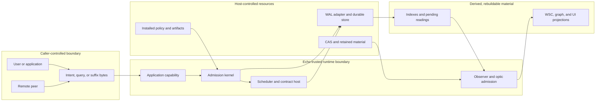

<!-- SPDX-License-Identifier: Apache-2.0 OR LicenseRef-MIND-UCAL-1.0 -->
<!-- © James Ross Ω FLYING•ROBOTS <https://github.com/flyingrobots> -->

# Echo Security Posture

Echo is a deterministic WARP runtime over witnessed causal history. Its
security posture begins with a strict authority rule:

```text
Untrusted callers propose.
Echo validates and admits.
Only a committed Echo transition becomes causal history.
Every other representation remains evidence, storage, or a reading.
```

This topic set documents the security assumptions used when designing and
reviewing Echo. It distinguishes implemented controls from architectural
requirements and open gaps. A type name, enum variant, planned release gate, or
ignored test is not an implemented security boundary.

## Documentation Map

- [Threat model](ThreatModel.md) describes protected assets, attacker
  capabilities, abuse cases, controls, residual risks, and non-goals.
- [Authority boundaries](AuthorityBoundaries.md) states exactly what each
  digest, receipt, WAL transaction, CAS object, capability, and projection can
  prove.
- [Runtime authority](../RuntimeAuthority.md) defines the application, trusted
  host, scheduler, observation, and recovery split.
- [WAL](../WAL.md) defines Echo's durable commit and recovery boundary.
- [Causal anchors](../CausalAnchors.md) separates application claims, root
  support, Echo admission, retention, and domain checkpoints.
- [Obstructions](../Obstructions.md) defines fail-closed refusal when required
  basis, capability, support, budget, or evidence is unavailable.

## Status Vocabulary

Security claims in this topic set use these labels:

| Label         | Meaning                                                                 |
| ------------- | ----------------------------------------------------------------------- |
| Implemented   | Current code and an executable witness enforce the claim.               |
| Partial       | A typed boundary or isolated control exists, but the end-to-end path is incomplete. |
| Required      | The architecture requires the control, but current code does not prove it. |
| Assumption    | Echo relies on the host, operating system, dependency, or cryptographic premise. |
| Non-goal      | Echo deliberately does not claim this property at the named boundary.   |

The status applies to the exact proposition in its row. An implemented digest
check does not make authentication implemented. An implemented recovery test
does not make storage Byzantine-resistant.

## Protected Assets

Echo's security design protects these assets:

1. **Causal-history integrity.** Committed facts, transitions, receipts,
   frontiers, and their ordering must not be silently altered, invented,
   omitted, duplicated, or reinterpreted.
2. **Authority confinement.** Application code, transport adapters, cached
   projections, and decoded values must not acquire admission, scheduler, tick,
   WAL, package-install, recovery, or reveal authority.
3. **Provenance integrity.** A receipt or witness must remain bound to the exact
   claim, basis, policy, causal parents, transition, and durable coordinates it
   actually attests.
4. **Deterministic recovery.** The same committed evidence must recover the same
   accepted, pending, decided, obstructed, or faulted posture.
5. **Bounded revelation.** A reading must not exceed its admitted basis,
   observer, aperture, capability, policy, and budget.
6. **Semantic separation.** CAS bytes, WSC material, files, graph
   materializations, indexes, and holograms must not impersonate causal
   authority.
7. **Availability posture.** Missing, corrupt, redacted, unsupported, or
   over-budget material must produce an explicit obstruction instead of false
   success.

Confidentiality, secure deletion, process sandboxing, network channel security,
and Byzantine-host resistance are separate properties. They are not implied by
the assets above.

## Trust Boundaries



The arrows are data and control flow, not transitive trust. In particular:

- Caller-controlled bytes remain untrusted after decoding.
- Installed policy and artifact identities are host-owned inputs to admission;
  a caller cannot supply testimony that it is authorized.
- The WAL is the durable commit mechanism, but a decoded WAL frame is not
  automatically lawful history. Recovery validates transaction shape,
  authority, integrity, ordering, and cross-evidence consistency.
- CAS and projections may support a reading. They do not admit history.
- An application capability is an API confinement boundary, not an operating
  system sandbox for hostile code in the same process.

## Security Properties

### Causal integrity

Echo uses canonical encodings, domain-separated BLAKE3 digests, typed identity,
commit chains, exact frame cardinality, causal-basis checks, and deterministic
replay witnesses to detect inconsistent evidence. These controls are designed
to make accidental corruption and unsupported causal claims fail closed.

The digests are unkeyed. They provide content integrity and identity under the
assumption that BLAKE3 remains collision resistant. They do not authenticate a
person, process, host, or peer.

### Admission authority

Applications submit proposals through constrained capabilities. Echo-owned
code validates shape, identity, basis, support, and the policy available at the
specific boundary before constructing admitted evidence. The trusted host owns
scheduler opportunities, WAL append authority, package installation, recovery,
and causal-anchor root-support policy.

This boundary is implemented for the trusted runtime and causal-anchor paths.
Production authentication and target authorization for all generated intent
paths remain incomplete. The registry handshake is compatibility evidence, not
a production security certificate.

### Durable commit and recovery

For WAL-backed trusted application paths, Echo returns success only after the
relevant transaction commits. Recovery rebuilds indexes and application
posture from committed transactions and ignores uncommitted tail frames.
Malformed, truncated, duplicated, reordered, unknown-version, or
cross-inconsistent evidence is rejected or obstructed.

Durability depends on the selected adapter. The in-memory WAL is a test and
development mechanism. User-facing durability requires the filesystem adapter
or another adapter with equivalent, tested flush and crash semantics.

### Bounded observation

The intended product read boundary binds an explicit causal basis, bounded
aperture, named law, capability, support posture, and budget. Attachment
descent and isolated capability-grant validation have executable negative
witnesses.

The current high-level optic bridge is partial. It does not yet validate every
caller-supplied optic, capability, or law identifier against trusted installed
authority, and `QueryBytes` is not yet a supported product projection law.
Lower-level raw observation is therefore not a production authorization
boundary.

### Confidentiality and privacy

Echo does not currently claim confidentiality for WAL payloads. The current
WAL builder records full payload bytes with `WalRedactionPosture::Present`.
Redaction and encryption posture enums describe representable states; they do
not implement encryption, key management, policy enforcement, or secure
deletion.

The parallel privacy tests are ignored and marked unimplemented. Sensitive or
erasable plaintext must not be placed in append-only causal history under the
assumption that Echo will later remove it. Applications need a separately
designed secret or erasable-material boundary before storing such data.

### Availability and resource control

Optic budgets, bounded apertures, deterministic scheduler policies, checked
integer transitions, and typed obstruction posture provide pieces of resource
control. Echo does not yet claim comprehensive denial-of-service resistance
against hostile payload sizes, decompression bombs, expensive generated rules,
unbounded graph growth, storage exhaustion, or adversarial query patterns.

Resource limits must be enforced before allocation and before expensive
validation at every external byte boundary. A deterministic out-of-memory
failure is still an availability failure.

## Current Posture Matrix

| Boundary or property                  | Status       | Current posture |
| ------------------------------------- | ------------ | --------------- |
| Canonical causal-anchor claims        | Implemented  | Canonical roots, schema checks, claim digests, and value/admission separation have executable witnesses. |
| Causal-anchor trusted admission       | Implemented  | Current basis and host-owned exact root support are required before atomic WAL fact/receipt commit. |
| Trusted runtime WAL commit/recovery   | Implemented  | Commit-before-return, crash-tail exclusion, corruption refusal, and read-only index rebuild are witnessed. |
| Same-process API authority split      | Implemented  | App handles cannot install policies, append WAL facts, tick, or recover; this is not process isolation. |
| Generated package compatibility       | Implemented  | Registry, schema, artifact, codec, and operation bindings reject incompatible packages. |
| Production intent authentication      | Required     | Current canonical intent acceptance does not prove an authenticated session or principal. |
| End-to-end target authorization       | Partial      | Capability grant and obstruction machinery exists; all public app paths and trusted expiry/revocation policy are not yet wired through it. |
| Product optic authorization           | Partial      | Basis, aperture, attachment, and budget checks exist; trusted capability and law binding is incomplete. |
| WAL payload confidentiality           | Non-goal now | Current writes retain full plaintext payload bytes. |
| Secure deletion from causal history   | Non-goal     | Append-only evidence and replicated/CAS material cannot promise erasure without a separate design. |
| Continuum peer/channel authentication | Required     | Transport arrival is non-authoritative, but production peer identity and channel security need separate proof. |
| Whole-store rollback detection        | Required     | Internal chains detect inconsistency; a valid older store needs an external freshness anchor to be distinguishable. |
| Comprehensive hostile-input DoS       | Partial      | Local budgets and checked codecs exist; no system-wide adversarial resource envelope is proven. |
| Compromised trusted host resistance   | Non-goal     | A host that owns admission keys, policy, scheduler, and storage can violate Echo's local trust assumptions. |
| Side-channel resistance               | Non-goal now | Timing, access-pattern, memory-remanence, and speculative-execution leakage are not presently claimed. |

## Trusted Computing Base

The current local trusted computing base includes:

- the Echo trusted runtime and admission code executing in the host process;
- the generated package verifier and the artifact/policy material the host
  chooses to install;
- the Rust compiler, dependencies, and build artifacts used for that binary;
- the WAL adapter and its implementation of commit, flush, reopen, and recovery;
- the operating system and storage stack for persistence and process isolation;
- BLAKE3 collision resistance for identities that use BLAKE3; and
- any authentication, authorization, encryption, key-management, or transport
  layer added by the embedding host.

Echo validates bytes read back from storage. It does not assume that every byte
returned by storage is correct. It does assume the trusted host invokes the
correct policy and that an attacker cannot arbitrarily alter the running Echo
process without that compromise being outside the local model.

## Rules For Security Claims

1. Name the exact proposition an artifact proves.
2. Separate caller claims from Echo admission evidence.
3. Separate content integrity from actor authenticity.
4. Separate authorization from runtime support and availability.
5. Separate semantic authority from storage and materialization.
6. Treat decoded and copied values as untrusted until their support chain is
   validated at the use site.
7. Bind every cached reading to basis, aperture, observer authority, policy,
   schema, evaluator, coverage, and completeness.
8. Fail closed with a typed obstruction when required evidence is absent,
   stale, corrupt, redacted, unsupported, or outside budget.
9. Never convert an unimplemented test, enum variant, or design document into a
   production claim.
10. Add a negative witness for every new authority or reveal boundary.

## Primary Evidence

- [Causal WAL implementation](../../../crates/warp-core/src/causal_wal.rs)
- [Trusted runtime host](../../../crates/warp-core/src/trusted_runtime_host.rs)
- [Causal-anchor contract](../../../crates/warp-core/src/causal_anchor.rs)
- [WAL hardening witnesses](../../../crates/warp-core/tests/causal_wal_hardening_tests.rs)
- [Causal-anchor WAL witnesses](../../../crates/warp-core/tests/causal_anchor_wal_tests.rs)
- [Capability validation witnesses](../../../crates/warp-core/tests/capability_grant_validation_tests.rs)
- [Optic admission witnesses](../../../crates/warp-core/tests/optic_invocation_admission_tests.rs)
- [Attachment boundary witnesses](../../../crates/warp-core/tests/optic_attachment_tests.rs)
- [Privacy tests and explicit gaps](../../../crates/warp-core/tests/parallel_privacy.rs)
- [Application admission security ramp](../../architecture/application-contract-hosting.md#admission-security-ramp)
- [Retained reading proof boundary](../../adr/0020-retained-reading-storage-and-proof-boundary.md)
- [Public optic boundary](../../adr/0021-public-optic-observation-boundary.md)
