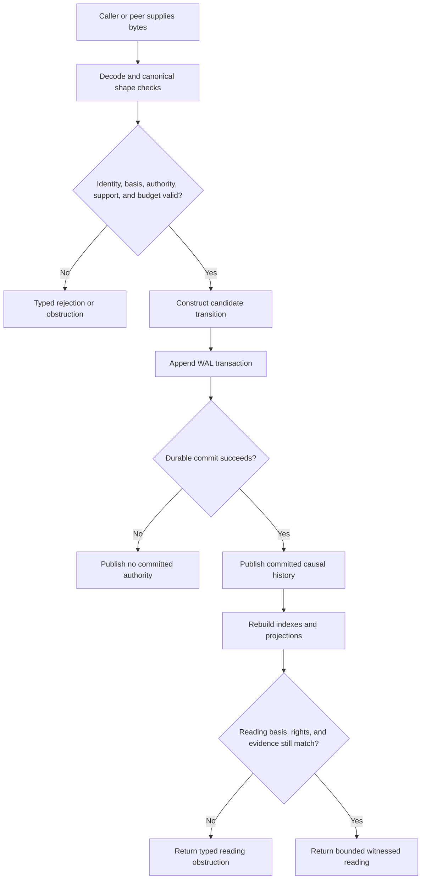
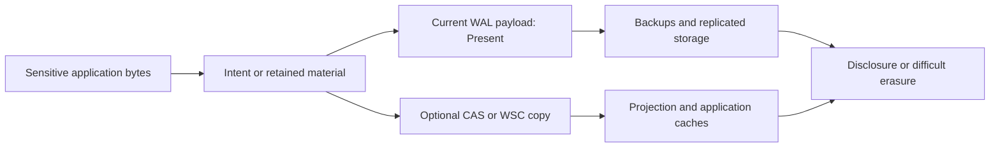

<!-- SPDX-License-Identifier: Apache-2.0 OR LicenseRef-MIND-UCAL-1.0 -->
<!-- © James Ross Ω FLYING•ROBOTS <https://github.com/flyingrobots> -->

# Echo Threat Model

This document models threats to Echo's causal integrity, authority boundaries,
recovery, bounded observation, retained material, and embedding interfaces. It
is an engineering threat model, not a certification claim.

The model covers the current in-process trusted runtime and the architectural
boundaries required for production applications. Each mitigation is labelled
by its actual implementation posture in the [security overview](README.md).

## Scope

In scope:

- application intent, query, causal-anchor, and inverse proposals;
- generated package installation and operation dispatch;
- trusted-host admission, scheduling, receipt creation, and recovery;
- causal WAL construction, persistence, reopen, validation, and replay;
- CAS, WSC, retained readings, materializations, and projection caches;
- Continuum suffix exchange and remote admission boundaries;
- capability presentations, observer apertures, revelation, and budgets;
- deterministic replay, duplicate handling, stale basis, and downgrade;
- corruption, truncation, storage loss, and resource exhaustion.

Out of scope unless an embedding profile adds a separate control:

- a fully compromised trusted host process or operating-system kernel;
- physical attacks on the host or memory extraction;
- cryptanalytic breaks of BLAKE3 or other selected primitives;
- application-specific policy correctness;
- anonymous traffic analysis and timing side channels;
- secure erasure from replicated, backed-up, or content-addressed storage;
- availability during catastrophic loss of every retained copy.

## Attacker And Failure Classes

| Class | Capability |
| ----- | ---------- |
| Untrusted application caller | Constructs arbitrary intent, query, anchor, capability-presentation, and payload bytes; retries and reorders requests; cites stale or unrelated identities. |
| Malicious generated artifact | Attempts to misdeclare operations, footprints, effects, schemas, requirements, or native capability. |
| Remote Continuum peer | Sends duplicate, reordered, stale, conflicting, malformed, or tampered suffix material and lies about local state. |
| Unauthorized observer | Requests a wider aperture, different subject, hidden attachment, unsupported law, or privileged cached result. |
| Storage fault or attacker | Truncates, corrupts, duplicates, reorders, deletes, or substitutes WAL, WSC, CAS, or manifest bytes. |
| Replay or rollback attacker | Replays valid old proposals, receipts, bundles, or an internally valid older durable store. |
| Resource attacker | Sends oversized or numerous requests, constructs expensive rules or queries, exhausts WAL/CAS space, or forces repeated recovery work. |
| Accidental implementation fault | Produces noncanonical bytes, divergent replay, partial publication, stale cache use, identity confusion, or a false success posture. |

The current API split assumes application code cannot obtain the trusted-host
handle by ordinary supported APIs. It is not a sandbox against hostile code
already executing with arbitrary memory access in the Echo process.

## Threat Flow

The critical security transitions are the two diamonds. Canonical decoding is
not admission, and successful admission is not permission to reveal every
derived reading.

## Threat Register

### TM-01: Caller fabricates admitted authority

**Attack.** A caller constructs a value that looks like an admitted fact,
receipt, tick, anchor, WAL coordinate, law witness, or scheduler decision and
asks downstream code to trust it.

**Current controls.** Application requests omit Echo-owned receipt fields.
Trusted admission derives identities inside Echo. App handles do not expose WAL
append, scheduler, policy-install, or recovery methods. Recovered causal-anchor
evidence has private fields and read-only accessors. Cross-evidence validation
requires facts, receipts, causal coordinates, and WAL transaction coordinates
to agree.

**Residual risk.** Public value types and serialized bytes can be copied.
Possessing such a value does not carry its support chain. Every use site must
require trusted provenance or recover the value from committed evidence. The
Rust type boundary does not stop arbitrary code execution in the host process.

### TM-02: Unauthorized or unauthenticated application intent

**Attack.** A caller submits a well-formed operation without proving an
authenticated principal, session, target authority, or permission for the
affected causal coordinate.

**Current controls.** Canonical intent shape, reserved-operation checks,
installed-package identity, and operation/package compatibility are enforced.
Capability-grant validation can reject malformed, unbound, unknown, expired,
artifact-mismatched, operation-mismatched, and requirements-mismatched
presentations in its tested boundary. Expiry rejection currently depends on an
explicit caller-supplied expiry posture; the validator does not parse the
grant's expiry bytes.

**Residual risk.** The current generic EINT path does not prove production
authentication or end-to-end target authorization. The registry handshake is
compatibility evidence. The default capability validation path uses an
unevaluated expiry posture and does not establish trusted clock, revocation,
delegation, or quorum policy. Embedders must not expose current canonical
dispatch as an Internet-facing authorization boundary without completing the
admission security ramp.

### TM-03: Caller-supplied testimony bypasses Echo policy

**Attack.** A caller supplies its own capability result, runtime-support claim,
scheduler candidate, law witness, root-support policy, or invocation admission
testimony.

**Current controls.** Optic admission tests preserve Echo-owned fixtures for
runtime support, invocation admission, scheduler admission, work candidacy, and
law witnesses. Causal-anchor support policy is installed only through the
trusted host. Unsupported or absent testimony produces typed obstruction.

**Residual risk.** Some optic stages remain fixtures or partial integration.
The architecture must retain Echo ownership when replacing fixtures with real
providers. Moving a field from internal state into a public request would be a
security regression even if tests remain deterministic.

### TM-04: Stale-basis mutation or confused-deputy rewrite

**Attack.** A proposal names an old frontier, an unrelated worldline, or a valid
receipt from a different subject and asks Echo to apply it to current history.

**Current controls.** Trusted admission resolves an explicit basis and compares
it to current durable history. Inverse admission binds the target receipt and
current-basis receipts as causal parents. Causal-anchor admission requires the
current logical frontier. Continuum import must resolve explicit target basis
and cannot silently mutate current history when stale.

**Residual risk.** Every new mutation API must preserve explicit-basis checks.
Adapters that silently substitute the current head for a caller's stale basis
would erase the conflict the causal model is meant to retain.

### TM-05: Duplicate and replayed requests become duplicate history

**Attack.** A caller retries the same accepted intent, anchor claim, or suffix,
or replays an old request after restart to mint a second semantic event.

**Current controls.** Content-addressed submission identity, generation
tracking, retained outcomes, exact causal-anchor retry recovery, and suffix
idempotence rules distinguish exact replay from new work. Divergent duplicates
are errors or obstructions rather than first-wins normalization.

**Residual risk.** Idempotence is semantic-coordinate-specific. Same visible
state is not sufficient. A new API that deduplicates only by payload bytes,
state root, local tick, or receipt content digest can collapse distinct causal
events.

### TM-06: Torn, truncated, reordered, or corrupted WAL

**Attack.** Storage returns a partial transaction, invalid checksum, broken
digest chain, unknown enum, trailing bytes, duplicate singular frame, reordered
required frame, mismatched transaction coordinate, or cross-wired evidence.

**Current controls.** WAL validation checks header and frame checksums, payload
digests, transaction roots, commit digests, previous-commit chaining, authority
for transaction and record kinds, versioned canonical codecs, frame order and
cardinality, and domain-specific cross-evidence invariants. Recovery excludes
uncommitted tails and returns typed corruption or obstruction.

**Residual risk.** Checksums are not cryptographic authentication. Unkeyed
digests detect modification only relative to trusted roots and the collision
assumption. Durability and atomicity still depend on the adapter and host
storage semantics.

### TM-07: Valid-prefix rollback

**Attack.** An attacker replaces the entire durable store with an older, fully
valid prefix. Internal checksums and hash chains all verify because the prefix
was once legitimate.

**Current controls.** Internal chains prevent undetected splice or mutation
relative to a trusted later root. Causal anchors can name durable bases and
retained roots.

**Residual risk.** Echo cannot distinguish a valid older store from current
history without a freshness source outside that store, such as a remote quorum,
hardware monotonic counter, signed transparency log, operator-held root, or
another independently retained anchor. Whole-store anti-rollback is required
for profiles that face storage rollback attackers; it is not currently a local
WAL guarantee.

### TM-08: CAS or WSC substitution

**Attack.** Storage returns bytes for the wrong hash, valid bytes under the
wrong semantic coordinate, a missing blob, a tampered self-contained WSC
segment, or a projection that answers a different reading question.

**Current controls.** CAS-addressed import verifies byte hashes. WSC import
validates segment and retained-material digests. `ReadIdentity` and retained
material references remain distinct from content hashes. Missing or mismatched
material produces typed obstruction.

**Residual risk.** A matching content hash says only that the bytes match. It
does not prove admission, authority, availability, retention duration, reveal
permission, or semantic coordinate. CAS operators can still deny service by
deleting or withholding blobs.

### TM-09: Cross-observer projection-cache disclosure

**Attack.** A cache returns a projection created for a different causal basis,
observer capability, revelation policy, aperture, tenant, schema, evaluator,
or completeness posture.

**Current controls.** Echo's read identity and causal-anchor design require
observer-relative cache keys and explicit evidence posture. Attachment descent
without authority or budget is obstructed.

**Residual risk.** Cache-key completeness is an architectural requirement, not
a universal proof over every adapter. Final rendered views must not be shared
solely because output bytes or query text match. A privileged projection served
to a less privileged observer is a confidentiality breach even if its CAS hash
is correct.

### TM-10: Oversized aperture or hidden attachment descent

**Attack.** An observer requests an unbounded region, traverses an attachment
boundary without authority, or uses a low-cost request to trigger a high-cost
projection.

**Current controls.** Optic requests carry explicit apertures and budgets.
Attachment tests deny unauthorized descent and require attachment budget.
Budget failures remain typed obstructions.

**Residual risk.** The high-level product optic is not fully authorized, and
resource accounting is not proven for every observer, codec, generated rule,
or adapter. Budget units must correspond to actual bounded work rather than a
decorative request field.

### TM-11: Sensitive plaintext enters append-only history

**Attack.** An application writes secrets, personal data, credentials, or
erasable content into intent envelopes, WAL payloads, retained readings,
receipts, diagnostics, or CAS material. Replication and backups make later
deletion impractical.

**Current controls.** Evidence posture types can distinguish present, redacted,
encrypted-key-unavailable, missing, corrupt, and obstructed material.

**Residual risk.** Current WAL writes use `WalRedactionPosture::Present`; no WAL
encryption or key-management path is established. Privacy enforcement tests
are ignored and unimplemented. Posture metadata does not protect plaintext.
Applications must keep secrets out of causal history or use a separately
implemented encrypted/erasable vault with opaque references and explicit
revelation policy.

### TM-12: Remote peer injects false causal suffix

**Attack.** A peer sends malformed, stale, self-referential, reordered,
conflicting, or tampered suffix evidence and expects transport arrival to mutate
local history.

**Current controls.** Continuum transport is non-authoritative. The adapter
forms an import proposal; Echo verifies source identities, explicit target
basis, prior outcomes, and local admission law before any mutation. Outcomes
remain admitted, staged, plural, conflict, or obstructed.

**Residual risk.** Production network exchange, peer authentication, channel
confidentiality, disconnect/resume, and all negative cases remain Echo 1.0
release gates. A secure transport channel would authenticate a channel or peer,
not make its semantic claims lawful automatically.

### TM-13: Malicious or mismatched generated package

**Attack.** A package misbinds schema, artifact hash, codec, operation kind,
rule identity, declared footprint, native capability, or handler implementation.

**Current controls.** Installed contract packages bind registry metadata,
schema and artifact hashes, codec identity, operation ids, handlers, observers,
and package rules. Unsupported operations, kind mismatches, rule/op mismatches,
and duplicate identities fail before engine mutation. Generated semantic-source
validation covers a broader set of internal consistency constraints.

**Residual risk.** Digest verification is not publisher authentication or CI
attestation. The production trust ramp from local development through verified
generation and certified profiles is not complete. Echo must not trust
caller-supplied footprints.

### TM-14: Parser and resource exhaustion

**Attack.** A caller supplies huge lengths, deeply nested structures, many
roots, many parent receipts, repeated failures, storage-filling history, or
inputs selected to maximize validation and replay cost.

**Current controls.** Canonical decoders reject malformed and trailing bytes,
many counters use checked transitions, schedulers and optics expose local
budgets, and deterministic obstruction avoids hidden retry loops.

**Residual risk.** No comprehensive hostile-input size, depth, rate, CPU,
memory, WAL-growth, CAS-growth, or recovery-work budget is currently proven.
Every network or multi-tenant embedding needs quotas, admission limits, and
backpressure before treating Echo as denial-of-service hardened.

### TM-15: Nondeterministic or divergent replay

**Attack or fault.** Platform-dependent math, unordered iteration, mutable
ambient policy, wall-clock reads, callbacks during recovery, or version drift
causes the same committed evidence to produce different state.

**Current controls.** Canonical ordering, deterministic digests, explicit
policy and package identities, fixed deterministic math policy, replay
witnesses, and read-only recovery reduce this risk. Recovery avoids scheduler,
application, wall-clock, and network callbacks for the witnessed paths.

**Residual risk.** New dependencies, generated code, or host callbacks can
reintroduce nondeterminism. Reproducible builds and exact compatibility sets are
release requirements, not consequences of a passing local replay test.

### TM-16: Evidence is mistaken for authorization

**Attack.** A valid hash, proof opening, receipt, reading envelope, checkpoint,
or obstruction fact is presented as permission to read, write, tick, recover,
or reveal.

**Current controls.** Echo uses distinct typed identities and accepted ADRs that
separate storage, proof, semantic coordinates, capability, and admission.

**Residual risk.** This is primarily an integration threat. Adapters must check
the authority required for the operation at the time of use. A proof can be
cryptographically valid while the requested reveal remains unauthorized.

### TM-17: Trusted host compromise

**Attack.** An attacker executes arbitrary code in the trusted host, replaces
installed policy, calls host-only APIs, alters memory before hashing, or controls
the storage and freshness roots the host trusts.

**Current controls.** Ordinary app handles limit accidental authority leakage;
Rust memory safety reduces some classes of memory corruption.

**Residual risk.** This is outside the current local security model. Echo does
not use a separate process, hardware enclave, signing key, or independently
verified witness quorum to defend against its own fully compromised host. Such
a deployment needs a stronger profile and a reduced, auditable trusted
computing base.

## Confidentiality Threat Flow

The safe conclusion is not that append-only history is incompatible with
privacy. The safe conclusion is that privacy requires an explicit indirection,
encryption, key lifecycle, revelation, retention, and erasure design that is not
currently implemented by the WAL posture enum.

## Required Negative Witnesses

Every production profile should retain executable negative witnesses for:

- unauthorized and unauthenticated intent submission;
- stale basis, unrelated receipt, and cross-subject replay;
- caller-authored admission, scheduler, support, and law testimony;
- malformed, truncated, reordered, duplicated, and unknown-version WAL data;
- committed-prefix recovery and uncommitted-tail exclusion across process kill;
- valid-prefix rollback against an external freshness anchor;
- CAS hash mismatch, missing material, and semantic-coordinate substitution;
- cross-observer cache reuse and attachment reveal denial;
- expired, revoked, unknown, and scope-mismatched capabilities;
- oversized payload, aperture, parent set, root set, and replay suffix;
- disk-full, flush failure, CAS unavailability, and projection rebuild failure;
- remote duplicate, reordered, stale, self-looping, and tampered suffixes;
- package, schema, codec, artifact, footprint, and compatibility downgrade;
- plaintext-secret rejection or encrypted-vault indirection, once supported.

## Review Questions

Use these questions in security-sensitive code review:

1. Which bytes are caller controlled?
2. Which identity is recomputed, and under which canonical encoding and domain?
3. What trusted root or policy supports the identity?
4. Does this operation require authenticity, authorization, integrity,
   confidentiality, durability, freshness, or availability?
5. Which of those properties is actually enforced here?
6. Can a copied value or cache entry bypass the normal admission path?
7. Is the causal basis explicit and current for the proposition being made?
8. What happens on duplicate, stale, missing, corrupt, redacted, unsupported,
   over-budget, or storage-failure input?
9. Can recovery reach the same result without app, scheduler, clock, or network
   callbacks?
10. What is the smallest negative witness that proves the boundary fails closed?

## Evidence Index

- [Causal WAL hardening tests](../../../crates/warp-core/tests/causal_wal_hardening_tests.rs)
- [Trusted runtime recovery tests](../../../crates/warp-core/tests/trusted_runtime_host_loop_tests.rs)
- [Causal-anchor tests](../../../crates/warp-core/tests/causal_anchor_tests.rs)
- [Causal-anchor WAL tests](../../../crates/warp-core/tests/causal_anchor_wal_tests.rs)
- [Capability-grant validation tests](../../../crates/warp-core/tests/capability_grant_validation_tests.rs)
- [Optic invocation admission tests](../../../crates/warp-core/tests/optic_invocation_admission_tests.rs)
- [Optic attachment tests](../../../crates/warp-core/tests/optic_attachment_tests.rs)
- [WSC storage tests](../../../crates/warp-core/tests/wsc_store_tests.rs)
- [Explicitly unimplemented privacy tests](../../../crates/warp-core/tests/parallel_privacy.rs)
- [Continuum authority decision](../../adr/0013-echo-continuum-authority-boundary.md)
- [Application admission security ramp](../../architecture/application-contract-hosting.md#admission-security-ramp)
- [Echo 1.0 release integrity requirements](../../releases/echo-1.0-contract.md)
