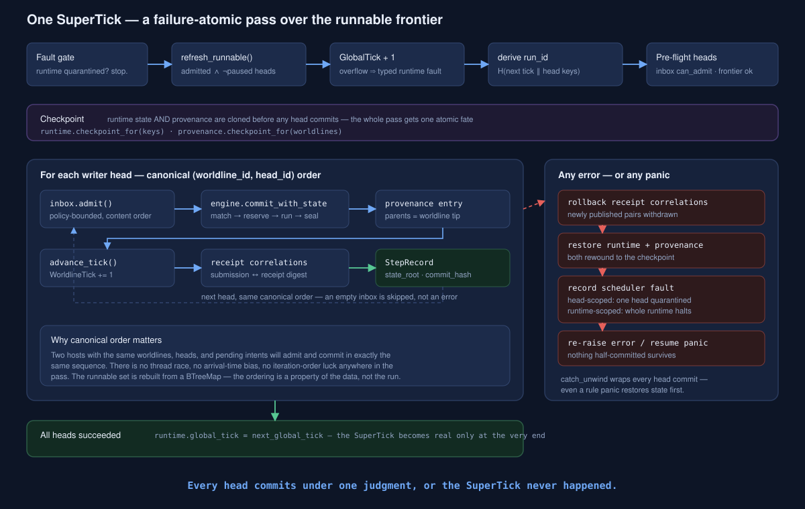
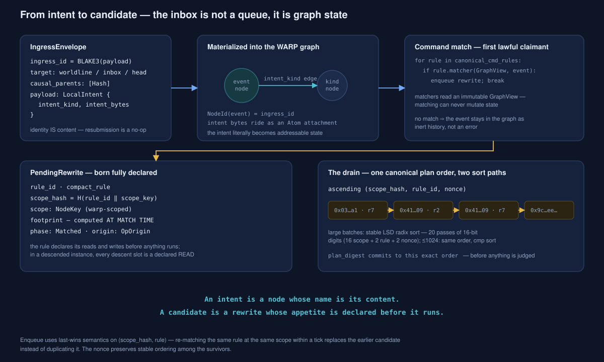
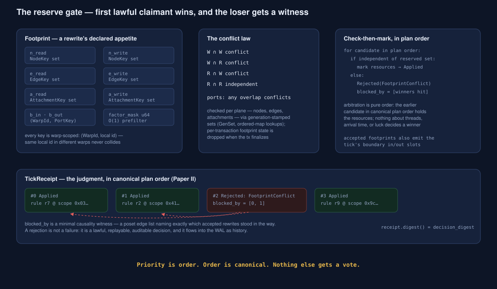
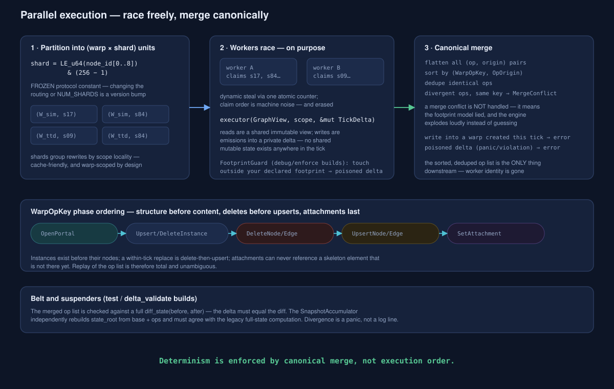
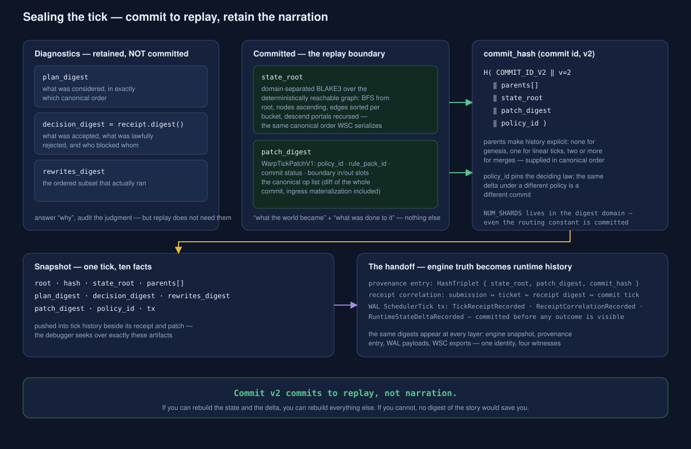

<!-- SPDX-License-Identifier: Apache-2.0 OR LicenseRef-MIND-UCAL-1.0 -->
<!-- © James Ross Ω FLYING•ROBOTS <https://github.com/flyingrobots> -->

# The SuperTick — How Echo Decides

> ```text
> A WAL proves Echo can survive interruption between causal events.
> The SuperTick is the causal event.
> ```

This is the end-to-end deep dive into Echo's decision engine: the path an
intent travels from content-addressed ingress envelope to committed tick, and
the machinery that makes that path deterministic — not by running one thing at
a time, but by making _order_ a property of the data instead of the run.

It is the companion volume to
[The Causal WAL and WSC](../wal-wsc/README.md), which treats `super_tick` as a
black box that emits receipts. This document opens the box. The sharpest
structural insights it surfaced are distilled in
[the WoahMan ledger](../WOAHMAN.md).

Everything described here is implemented in `warp-core`:

| Layer             | Source                                                            | What it is                                                           |
| ----------------- | ----------------------------------------------------------------- | -------------------------------------------------------------------- |
| SuperTick pass    | `crates/warp-core/src/coordinator.rs`                             | The failure-atomic scheduler pass over runnable writer heads         |
| Rewrite engine    | `crates/warp-core/src/engine_impl.rs`                             | Match → reserve → execute → seal, per head                           |
| Radix scheduler   | `crates/warp-core/src/scheduler.rs`                               | O(n), zero-comparison canonical ordering and O(1) conflict detection |
| Footprints        | `crates/warp-core/src/footprint.rs`                               | Declared read/write sets and the conflict law                        |
| Parallel executor | `crates/warp-core/src/parallel/`                                  | Shard-partitioned execution with canonical merge                     |
| Tick artifacts    | `crates/warp-core/src/receipt.rs`, `tick_patch.rs`, `snapshot.rs` | Receipt, patch, and the commit hash                                  |

## 1. The problem the SuperTick solves

Echo promises that the same intents, submitted to the same worldlines, produce
the same state — bit for bit, on any machine, forever. That promise dies the
moment any of the following leaks into a decision:

- thread scheduling (who finished first),
- arrival time (who asked first by the wall clock),
- iteration order of a hash map,
- panic recovery that leaves half a tick behind.

The classic escape is to serialize everything: one thread, one queue, one
decision at a time. Echo refuses the trade. Its answer is a two-part
discipline that recurs at every layer of this document:

```text
1. Every choice is made in a canonical order derived from content.
2. Everything that runs in parallel is merged back in canonical order,
   so execution order is unobservable.
```

A SuperTick is one application of that discipline: one deterministic pass over
every runnable writer head, committing each head's admitted work against its
worldline — all of it judged, all of it recorded, all of it atomic.

## 2. Time, in three clocks

Echo's clocks are logical, monotone counters. None of them carries wall-clock
or elapsed-time semantics — CI enforces that no system time enters
deterministic paths.

| Clock           | Scope                  | Advances when                                                 |
| --------------- | ---------------------- | ------------------------------------------------------------- |
| `GlobalTick`    | The runtime            | Once per successful SuperTick — at the very _end_ of the pass |
| `WorldlineTick` | One worldline          | Once per committed head-commit on that worldline              |
| `TxId`          | One engine transaction | Per commit attempt inside the engine                          |

The ordering of these advances is load-bearing. `GlobalTick` is incremented
_speculatively_ at the start of the pass (its overflow is a typed fault, not a
wrap), used to derive the pass's `run_id` and stamp every commit, but only
_written back_ to the runtime after every head has succeeded. A SuperTick that
fails leaves the clock untouched: the pass never happened.

## 3. The pass



`SchedulerCoordinator::super_tick(runtime, provenance, engine)` runs in five
movements:

**Gates.** If the runtime carries an active scheduler fault, the pass refuses
to start. The runnable set is rebuilt — every writer head that is admitted and
not paused, in canonical `(worldline_id, head_id)` order straight out of a
`BTreeMap`. The next `GlobalTick` is computed (overflow → recorded runtime
fault), and a `run_id` is derived from the tick and the head keys, so faults
are attributable to a specific pass over a specific frontier.

**Pre-flight.** Every runnable head is checked before any head commits: does
its inbox have admissible work under its policy, and can its worldline
frontier still advance? Discovering a doomed head _after_ three others
committed would force a rollback that pre-flight makes unnecessary in the
common case.

**Checkpoint.** The runtime state and the provenance service are both
checkpointed. This is the atomicity device for the whole pass.

**The loop.** For each head, in canonical order:

1. `inbox.admit()` drains the head's pending envelopes under its policy
   (§4.1).
2. `engine.commit_with_state(frontier_state, admitted)` runs the entire
   match → reserve → execute → seal pipeline (§4–§7) against that worldline's
   state and returns a `CommitOutcome { snapshot, receipt, patch }`.
3. A provenance entry is appended: the worldline's parents (its current tip),
   the `WorldlineTickPatchV1`, and the `HashTriplet` of
   `state_root`/`patch_digest`/`commit_hash`.
4. The committed ingress ids are recorded against the frontier (the
   idempotence ledger), the worldline tick advances, and receipt correlations
   are published so applications can find their outcomes.

An empty inbox is skipped, not an error. Each head's work runs inside
`catch_unwind`.

**Judgment.** If _any_ head fails — a typed error or a raw panic from rule
code — the pass unwinds completely: receipt correlations are rolled back, the
runtime and provenance are restored from their checkpoints, and a scheduler
fault is recorded with explicit scope (`Head` quarantines one head;
`Runtime` halts the scheduler until trusted recovery clears it). Then the
error is re-raised — a panic is `resume_unwind`ed _after_ the state is safe.
Only when every head has succeeded does `runtime.global_tick = next` make the
SuperTick real.

```text
Every head commits under one judgment, or the SuperTick never happened.
```

This is the exact property the WAL relies on: `tick_once()` in the trusted
host can record `SchedulerTick` transactions after `super_tick` returns,
knowing that the receipts it is persisting are either all real or all gone.

## 4. From intent to candidate



### 4.1 The envelope and the inbox

All inbound work is an `IngressEnvelope`: a routing target (a worldline's
default writer, a named inbox address, or — for control/debug paths only — an
exact head), causal parent references, and a payload. Its identity is its
content: `ingress_id = BLAKE3(payload)`. Submitting the same intent twice
yields the same id, and the inbox — a `BTreeMap` keyed by `ingress_id` —
absorbs the duplicate silently. Idempotence is not a retry heuristic bolted on
top; it is a consequence of naming.

`HeadInbox::admit()` drains pending envelopes under the head's policy:
`AcceptAll`, `Budgeted { max_per_tick }` (which takes the _first N in content
order_, not arrival order), or `KindFilter`. Note what the `BTreeMap` bought:
even admission order is content order. Two hosts that saw the same envelopes
in different arrival orders admit them identically.

Intent kinds are content-addressed too — `IntentKind` is a domain-separated
BLAKE3 of the kind label, deliberately _not_ a Rust `TypeId`, so kind identity
survives compiler versions and platforms.

### 4.2 The intent becomes a node

Here is the move that makes Echo's ingress model unusual: an admitted envelope
is not handed to a dispatcher. It is **materialized into the WARP graph**. The
engine creates an event node whose `NodeId` _is_ the `ingress_id`, attaches
the raw intent bytes as an Atom attachment, and links it by a typed edge to a
kind node derived from the `IntentKind`.

The consequences compound:

- The "queue" is ordinary graph state — snapshotted by WSC, hashed into
  `state_root`, replayed like everything else. There is no side-channel
  data structure whose contents could diverge from committed history.
- Dispatch is not a `match` statement. It is **pattern matching on the
  graph**: registered command rules are tried in canonical order, and the
  first whose matcher accepts the event node claims it
  (`enqueue_first_matching_command`). Matchers receive an immutable
  `GraphView` — matching cannot mutate.
- An event no rule matches simply remains in the graph as inert, replayable
  history — not an error, not a dropped message.

### 4.3 The candidate is born fully declared

When a rule matches at a scope, `apply_in_warp` builds a `PendingRewrite`
carrying everything the tick will ever need to judge it:

- `scope_hash = H(rule_id ‖ scope_key)` — the candidate's ordering identity;
- the **footprint**, computed _at match time_ by the rule's `FootprintFn`
  against the same immutable view — the declared read/write appetite of the
  execution that has not happened yet;
- if the scope lives inside a descended (portal) instance, every attachment
  slot in the descent chain is force-inserted into the read set, so changing
  a portal pointer deterministically invalidates matches beneath it.

A rewrite rule itself is a triple of pure functions over `GraphView` —
`matcher`, `compute_footprint`, `executor` — plus a conflict policy. The
executor does not touch state either: it _emits_ operations into a private
`TickDelta` (§6). Nothing in a rule's lifecycle ever holds a mutable reference
to the world.

### 4.4 The drain — canonical plan order

Candidates accumulate in the `RadixScheduler` with last-wins semantics on
`(scope_hash, rule)`: re-matching the same rule at the same scope within a
tick replaces the earlier candidate rather than duplicating it. At commit
time, `drain_for_tx` returns them in ascending `(scope_hash, rule_id, nonce)`
order via a stable LSD radix sort — 20 passes of 16-bit digits (16 for the
full 32-byte scope hash, 2 for the rule, 2 for the nonce), zero comparisons,
O(n).

The drained sequence is the tick's **plan**, and `plan_digest` commits to it
before anything is judged. Determinism of the plan is not asserted; it is
witnessed.

## 5. The reserve gate



### 5.1 Footprints and the conflict law

A `Footprint` declares seven sets — node reads/writes, edge reads/writes,
attachment reads/writes, and boundary ports — plus a coarse `factor_mask`
prefilter. Every key is **warp-scoped**: a `(WarpId, local_id)` pair, so two
rewrites in different warp instances that happen to touch the same local id
never produce a false conflict.

The conflict law is the classic one, applied per plane:

```text
write ∩ write   → conflict
write ∩ read    → conflict
read  ∩ write   → conflict
read  ∩ read    → independent
ports: any intersection → conflict
```

### 5.2 Check-then-mark, in plan order

`reserve_for_receipt` walks the plan in order. For each candidate, the
scheduler checks its footprint against everything already reserved this tick,
using generation-stamped sets (`GenSet`) for O(1) per-resource lookups — a new
tick resets the sets by bumping a generation counter, not by clearing memory.

- **Independent** → the candidate's resources are marked, its phase becomes
  `Reserved`, and its accepted footprint contributes the tick's boundary
  in/out slots.
- **Conflicting** → the candidate is rejected with
  `TickReceiptRejection::FootprintConflict`, and the engine computes its
  `blocked_by` list: the indices of the earlier-accepted candidates whose
  footprints actually intersect it.

Arbitration is pure order. The earlier candidate in canonical plan order holds
the resources; threads, arrival time, and luck get no vote. "Priority" in Echo
_is_ position in a content-derived order.

### 5.3 The receipt — rejection is history

The `TickReceipt` records, in plan order, every candidate's disposition —
`Applied` or `Rejected(FootprintConflict)` — with `blocked_by` as a parallel
list. That `blocked_by` structure is a minimal causality witness (the "poset
edge list" of AIΩN Paper II): not just _that_ a rewrite lost, but _to whom_.

This is why the WAL records `WalTickDecision::RejectedFootprintConflict` as a
_lawful_ decision rather than a failure: the rejection is deterministic,
auditable, and replayable. Recovery can prove an intent was lawfully out-fought
for its resources, not merely fail to find an application.

`receipt.digest()` becomes the tick's `decision_digest`.

## 6. Execution — race freely, merge canonically



The reserved rewrites are independent by construction — the gate guaranteed
their footprints are disjoint. That independence is what makes the next move
safe: run them in parallel, in _whatever order the machine likes_.

### 6.1 Work units

Rewrites are grouped by warp (a `BTreeMap`, so even the grouping is
deterministic), then partitioned into `(warp, shard)` work units by a routing
formula that is frozen as protocol:

```text
shard = LE_u64(node_id.as_bytes()[0..8]) & (NUM_SHARDS − 1)     NUM_SHARDS = 256
```

Frozen means frozen: `NUM_SHARDS` is recorded in the patch digest domain, so
changing the routing — or the shard count — changes commit hashes and is a
protocol version bump. Shards group rewrites by scope locality for cache
friendliness; they have no semantic meaning beyond that.

### 6.2 Workers

Workers claim units dynamically through a single atomic counter — genuine
work-stealing, genuinely racy. Each executor runs with:

```text
executor(GraphView, scope, &mut TickDelta)
```

Reads go through a shared immutable view of the pre-tick state; writes are
emissions into the worker's private delta. There is **no shared mutable state
anywhere in the tick**. In debug builds (and with `footprint_enforce_release`,
in release), a `FootprintGuard` wraps every view: an executor that touches
anything outside its declared footprint poisons its delta, and a poisoned
delta fails the merge. The footprint is not advice — it is a checked contract,
enforced at reserve time by the gate and at run time by the guard.

### 6.3 The canonical merge

Workers finish in machine order. Then the merge erases the machine:

1. Flatten all emitted `(op, origin)` pairs from every delta.
2. Sort by `(WarpOpKey, OpOrigin)` — both total orders.
3. Deduplicate identical ops.
4. If two writers produced _different_ ops for the same logical key —
   `MergeConflict`, and the engine explodes loudly. A merge conflict is not
   handled, because it cannot happen unless the footprint model lied, and a
   lying footprint model is a bug to fix, not a case to tolerate.
5. Reject writes into a warp created in the same tick, and reject any
   poisoned delta.

The output is a single canonical op list in which worker identity, claim
order, and finish order have simply ceased to exist.

```text
Determinism is enforced by canonical merge, not execution order.
```

### 6.4 Op phase ordering

`WarpOpKey` embeds a phase so that replaying the sorted list is total and
unambiguous: portal/instance operations sort before per-instance skeleton
edits (stores exist before their nodes), skeleton deletes sort before upserts
(within-tick replacement works), and attachment writes sort last (they can
never reference a skeleton element that is not there yet). The op vocabulary
itself is eight verbs — `OpenPortal`, `UpsertWarpInstance`,
`DeleteWarpInstance`, `UpsertNode`, `DeleteNode`, `UpsertEdge`, `DeleteEdge`,
`SetAttachment` — and `OpenPortal` is the atomic authoring operation for
descended instances: no replay may ever observe a dangling portal or an orphan
child instance.

The merged ops are applied to state through the same patch machinery replay
uses — the tick mutates the world through its own replay artifact, so "what we
did" and "what a replayer would do" cannot drift.

In `test`/`delta_validate` builds, two independent checks run on every commit:
the emitted delta must equal a full `diff_state(before, after)`, and the
`SnapshotAccumulator` must derive the same `state_root` from base + ops as the
legacy full-state computation. Divergence panics.

## 7. Sealing the tick



After execution, the engine seals the tick in layers:

**Materialization.** The materialization bus finalizes: rule-emitted output
channels are partitioned into successes and typed errors (e.g. a
`StrictSingle` channel written twice). Channel errors are boundary errors —
state committed, some outputs did not — and callers inspect them explicitly.

**The patch.** `diff_state(before, after)` produces the canonical op delta,
wrapped as `WarpTickPatchV1` with the policy id, the rule pack id, the commit
status, and the boundary in/out slots that accepted footprints declared. For
the runtime path (`commit_with_state`), the diff is taken across the _entire_
commit — ingress materialization included — so the patch is the complete
"what happened," not just the rewrites' share. Its digest is `patch_digest`.

**The state root.** `compute_state_root` hashes the reachable world under a
dedicated domain: a deterministic BFS from the root node that follows edges
and descends through portal attachments into child instances, hashing nodes in
ascending id order and each node's edges sorted by edge id. This is the same
canonical order WSC serializes — the fingerprint and the file agree by
construction.

**The commit hash.** Version 2 commits to _replay, not narration_:

```text
commit_hash = H( COMMIT_ID_V2 ‖ v=2 ‖ parents[] ‖ state_root ‖ patch_digest ‖ policy_id )
```

`plan_digest`, `decision_digest`, and `rewrites_digest` — what was considered,
what was decided and why, what ran — are retained in the `Snapshot` as
diagnostics but deliberately excluded from the commit id. If you can rebuild
the state and the delta, you can rebuild everything else; if you cannot, no
digest of the story would save you. Parents are explicit (none for genesis,
one for linear history, two or more for merges), and `policy_id` pins the
deciding law: the same delta under a different policy is a different commit.

**The snapshot.** All ten facts — root, hash, state root, parents, the three
diagnostic digests, patch digest, policy id, tx — are pushed into tick history
beside the receipt and the patch. This is the artifact the time-travel
debugger seeks over.

## 8. Above the engine — one identity, four witnesses

The SuperTick loop then threads the engine's outputs upward, and the same
digests appear at every layer without translation:

| Layer      | Artifact                          | Carries                                                                          |
| ---------- | --------------------------------- | -------------------------------------------------------------------------------- |
| Engine     | `Snapshot`                        | `state_root`, `patch_digest`, `commit_hash`                                      |
| Provenance | `ProvenanceEntry` + `HashTriplet` | the same three, plus parents and the worldline patch                             |
| Runtime    | `ReceiptCorrelationRecord`        | submission ↔ ticket ↔ `tick_receipt_digest` ↔ commit tick ↔ `commit_hash`        |
| WAL        | `SchedulerTick` transaction       | `TickReceiptRecorded`, `ReceiptCorrelationRecorded`, `RuntimeStateDeltaRecorded` |

The trusted host's `tick_once()` collects the _new_ receipt correlations after
`super_tick` returns and records them in the WAL before any outcome remains
visible — the ACK discipline documented in
[the WAL/WSC deep dive](../wal-wsc/README.md#2-the-commit-boundary-in-practice).
An application observing `IntentOutcome::Decided` is reading the end of a
chain whose every link is the same content-derived identity.

## 9. The invariants, in one place

1. **Canonical order everywhere.** Runnable heads by `(worldline_id,
head_id)`; admission by content id; the plan by `(scope_hash, rule_id,
nonce)`; the merge by `(WarpOpKey, OpOrigin)`; warps by id. No decision
   consults arrival time, thread identity, or map iteration luck.
2. **Identity is content.** Envelope ids, intent kinds, scope hashes, and
   commit hashes are all domain-separated BLAKE3 of what the thing _is_.
   Idempotence and dedup fall out of naming.
3. **The inbox is graph state.** Intents materialize as nodes; dispatch is
   pattern matching; unmatched events are inert history, not errors.
4. **Appetite is declared before execution.** Footprints are computed at
   match time, enforced at reserve time (the gate), and enforced again at run
   time (the guard).
5. **Rejection is a lawful decision.** Losers get a `blocked_by` witness;
   the receipt is digested into the tick and persisted through the WAL.
6. **No shared mutable state during execution.** Immutable views in, private
   deltas out; parallelism cannot corrupt what it cannot touch.
7. **Determinism by canonical merge, not execution order.** The race is
   real; its observability is zero.
8. **Merge conflicts are bugs.** A divergent write under disjoint-by-contract
   footprints means the model lied — the engine explodes rather than guesses.
9. **The tick mutates the world through its own replay artifact.** Applied
   ops and replayed ops are the same code path; the diff/accumulator
   cross-checks make drift a panic.
10. **Commit v2 commits to replay, not narration.** `state_root` +
    `patch_digest` + parents + policy; plan/decision/rewrites stay
    diagnostic.
11. **The SuperTick is failure-atomic — even against panics.** Checkpoint,
    `catch_unwind`, restore, scoped fault, re-raise. The global tick becomes
    real only at the end.
12. **Even the constants are committed.** `NUM_SHARDS` and the shard routing
    formula live in the digest domain; changing them is a protocol version
    bump, not a tuning knob.

## 10. Source map

| Where                                                      | What                                                                                                                                   |
| ---------------------------------------------------------- | -------------------------------------------------------------------------------------------------------------------------------------- |
| `crates/warp-core/src/coordinator.rs`                      | `SchedulerCoordinator::super_tick`, `WorldlineRuntime`, runnable set refresh, receipt correlations, fault recording                    |
| `crates/warp-core/src/engine_impl.rs`                      | `commit_with_state`, `commit_with_receipt`, `apply_in_warp`, `reserve_for_receipt`, `apply_reserved_rewrites`, ingress materialization |
| `crates/warp-core/src/scheduler.rs`                        | `RadixScheduler`, `PendingRewrite`, `GenSet` conflict detection, the 20-pass radix drain                                               |
| `crates/warp-core/src/footprint.rs` / `footprint_guard.rs` | Footprint sets, the conflict law, runtime enforcement                                                                                  |
| `crates/warp-core/src/parallel/`                           | `shard.rs` (frozen routing), `exec.rs` (policies, work queue), `merge.rs` (canonical merge)                                            |
| `crates/warp-core/src/head.rs` / `head_inbox.rs`           | Writer heads, `RunnableWriterSet`, `IngressEnvelope`, inbox policies                                                                   |
| `crates/warp-core/src/rule.rs`                             | `RewriteRule`: matcher / footprint / executor over `GraphView`                                                                         |
| `crates/warp-core/src/receipt.rs`                          | `TickReceipt`, dispositions, `blocked_by`                                                                                              |
| `crates/warp-core/src/tick_patch.rs`                       | `WarpOp`, `WarpOpKey` phase ordering, `WarpTickPatchV1`, `diff_state`                                                                  |
| `crates/warp-core/src/snapshot.rs`                         | `Snapshot`, `compute_state_root`, `compute_commit_hash_v2`                                                                             |
| `docs/spec/scheduler-warp-core.md`                         | The reserve-gate decisions as a spec packet                                                                                            |
| `docs/spec/canonical-inbox-sequencing.md`                  | Intent identity and tick-boundary ordering decisions                                                                                   |
| `docs/spec/warp-tick-patch.md` / `merkle-commit.md`        | Patch format and commit-hash decisions                                                                                                 |
| `docs/topics/wal-wsc/README.md`                            | What happens to a tick's outputs after this document ends                                                                              |

> ```text
> Race freely. Merge canonically. Commit to replay.
> ```
