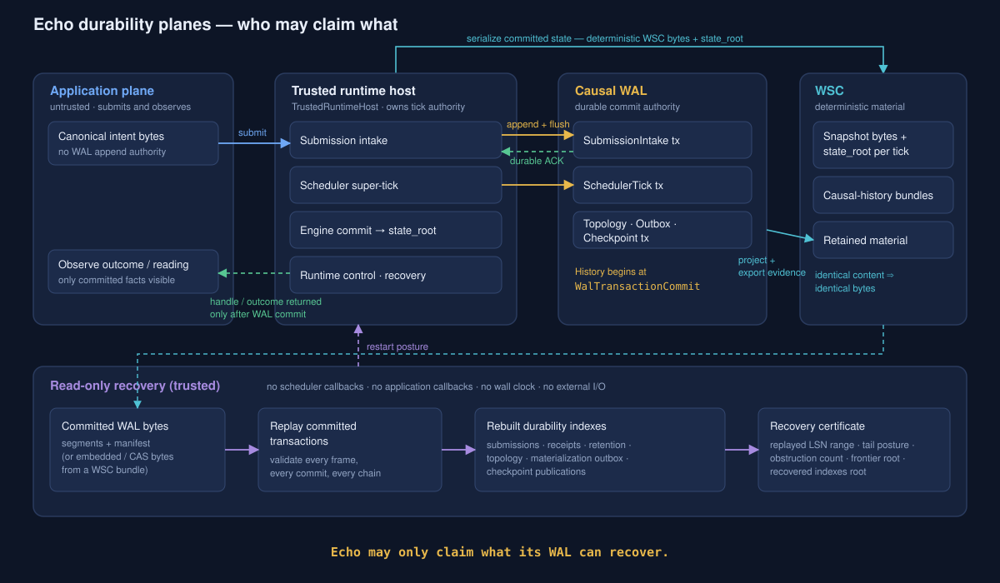
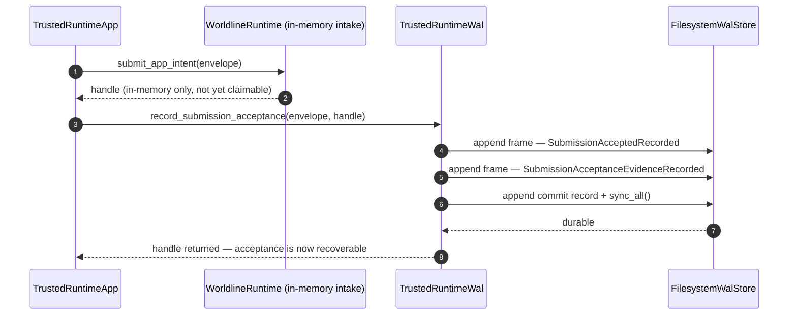
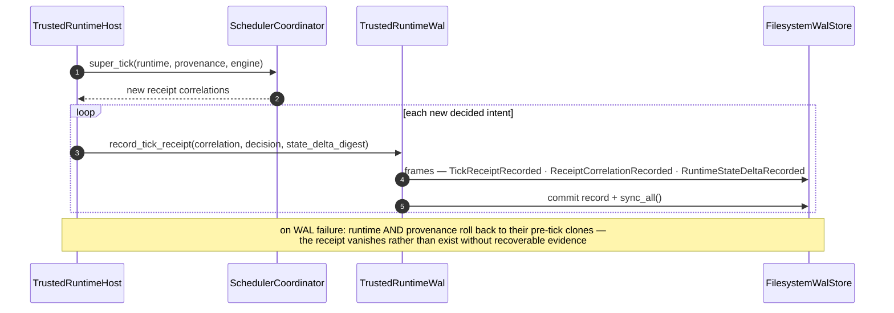
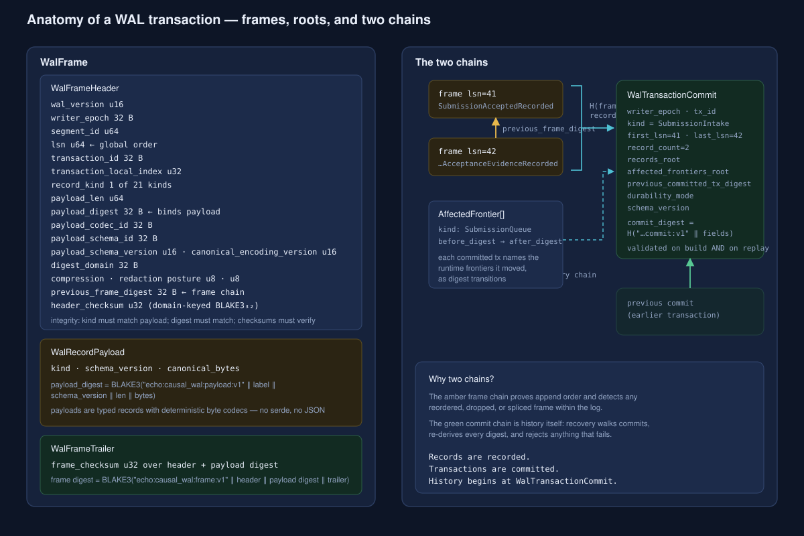
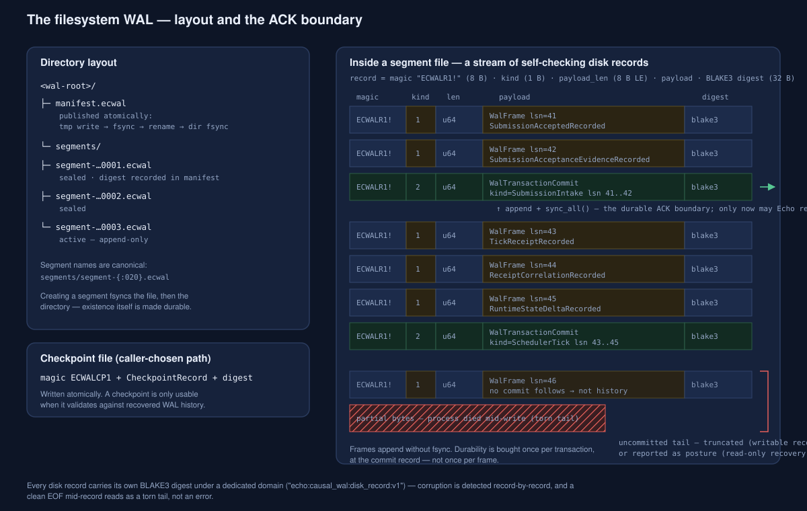
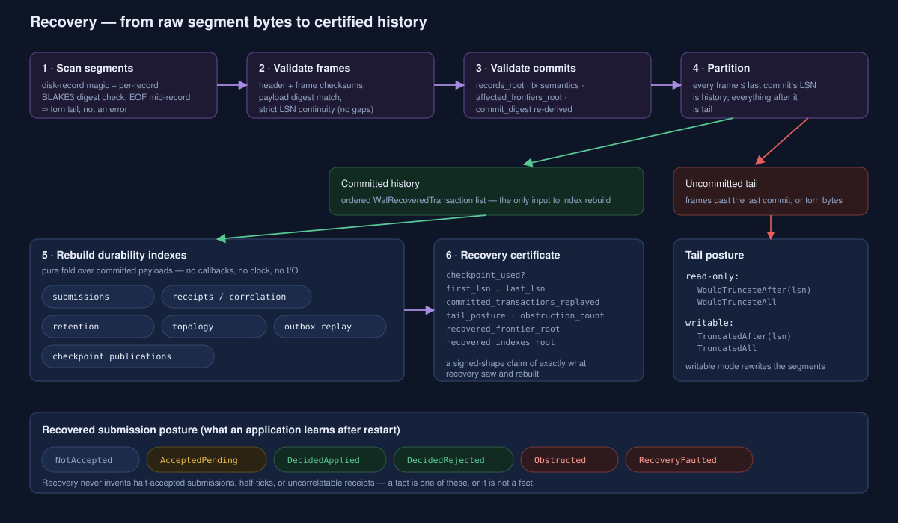
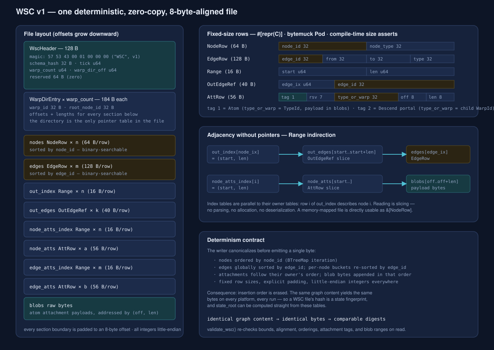
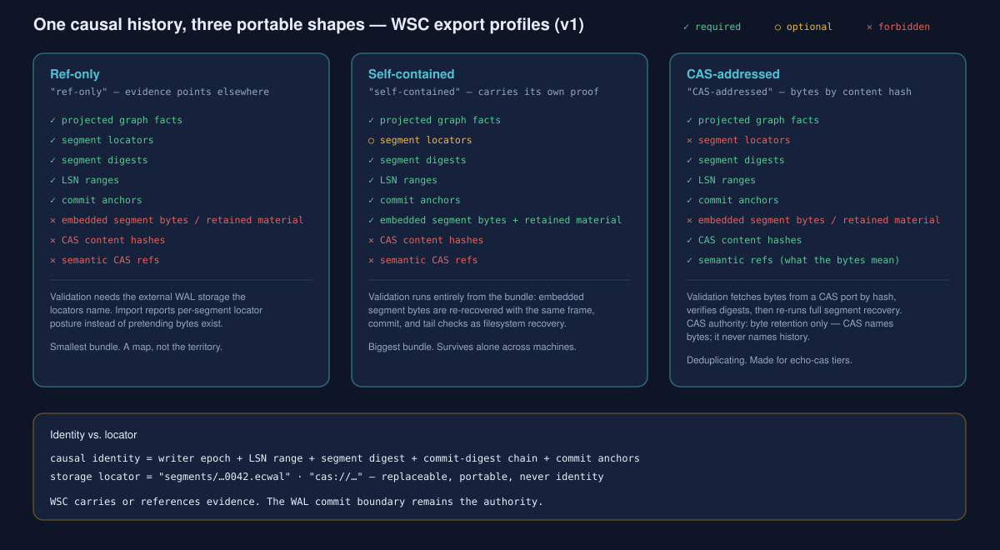

<!-- SPDX-License-Identifier: Apache-2.0 OR LicenseRef-MIND-UCAL-1.0 -->
<!-- © James Ross Ω FLYING•ROBOTS <https://github.com/flyingrobots> -->

# The Causal WAL and WSC — Echo's Durability Spine

> ```text
> A snapshot proves Echo can serialize state.
> A WAL proves Echo can survive interruption between causal events.
>
> Echo may only claim what its WAL can recover.
> ```

This is the end-to-end deep dive into Echo's two durability artifacts: the
**causal write-ahead log** (WAL) and the **Write-Streaming Columnar** snapshot
format (WSC). It explains what each one is at the byte level, what each one is
_for_ at the doctrine level, and how they meet inside the kernel. The
doctrine-level summary lives in [`docs/topics/WAL.md`](../WAL.md); this
document is the full tour underneath it.

Everything described here is implemented in `warp-core`:

| Artifact   | Source                                         | What it is                                                                                                                                                                      |
| ---------- | ---------------------------------------------- | ------------------------------------------------------------------------------------------------------------------------------------------------------------------------------- |
| Causal WAL | `crates/warp-core/src/causal_wal.rs`           | Append-only, hash-chained, domain-separated commit stream. The durable **commit authority** for causal history.                                                                 |
| WSC        | `crates/warp-core/src/wsc/`                    | Deterministic, zero-copy, columnar serialization of WARP graph state, plus the envelope format for exported causal-history bundles. **Material and evidence**, never authority. |
| Host loop  | `crates/warp-core/src/trusted_runtime_host.rs` | The reference trusted host that wires submissions, ticks, and recovery through the WAL.                                                                                         |



## 1. Two artifacts, one contract

Echo is a deterministic simulation engine. Determinism gets you replayability:
the same intents in the same order produce the same state, bit for bit. But
determinism says nothing about _interruption_. If the process dies between an
application being told "your intent was accepted" and the scheduler deciding
what that intent did, what is true after restart?

The WAL and WSC split that problem in half:

- **The WAL answers "what happened."** It is the only place where causal
  facts — accepted submissions, tick receipts, topology changes, retained
  material references, checkpoints — become durable. Its contract is blunt:

    ```text
    No durable claim without durable evidence.
    No visible outcome without committed history.
    No external effect without committed authorization.
    ```

- **WSC answers "what the state is."** It is how a WARP graph becomes bytes:
  canonically ordered, fixed-layout, memory-mappable. Identical graph content
  produces identical bytes, so a WSC file's digest is a state fingerprint.
  The engine derives `state_root` from exactly these tables, and exported
  causal-history bundles ride in WSC envelopes.

The relationship is asymmetric on purpose:

```text
WAL bytes are the durable commit authority.
WARP graph facts track WAL segment evidence.
WSC serializes graph facts and may bundle or reference WAL bytes.
```

A WSC snapshot can be regenerated from committed history. Committed history can
never be regenerated from a snapshot. That is why the WAL is the authority and
WSC is material.

## 2. The commit boundary in practice

The reference host (`TrustedRuntimeHost`) enforces one rule at every
app-visible surface: **nothing is claimed before the corresponding WAL
transaction is committed and flushed.** Two sequences carry almost all of the
weight.

### 2.1 Submission intake — the ACK path

`TrustedRuntimeApp::submit_intent_with_runtime_wal_ack(...)` returns an
`IntentSubmissionHandle` only after the acceptance is durable:



The failure branches are the interesting part:

- **No WAL configured** → the call fails with `RuntimeWalUnavailable` _before_
  mutating intake state. An unconfigured commit boundary is an error, not a
  silent downgrade.
- **WAL append/commit fails** → the in-memory intake mutation is rolled back
  (the runtime is restored from a pre-submit clone) and the error is returned.
  No half-visible submission survives.
- **Crash after commit, before return** → recovery finds the committed
  acceptance; a retry of the same `(submission_id, canonical_envelope_digest)`
  resolves through the recovered index to a stable duplicate posture instead
  of double-accepting. Filesystem mode even re-scans after an ambiguous
  error to detect "the commit actually landed" before rolling anything back.

### 2.2 Scheduler tick — receipts become visible only after commit

`tick_once()` runs one deterministic scheduler pass (`super_tick`), then
records a `SchedulerTick` transaction for each newly decided intent before the
outcome is allowed to remain visible:



The tick decision recorded in the WAL is one of `Applied`,
`RejectedFootprintConflict` (a _lawful_ rejection, not a fault), or
`Obstructed`. Note what this means: a rejection is history too. Recovery must
be able to prove an intent was lawfully rejected, not merely fail to find an
application.

### 2.3 Read-only recovery

`recover_read_only()` rebuilds the submission and receipt indexes purely from
committed WAL transactions — no scheduler callbacks, no application callbacks,
no wall clock, no external I/O — and emits a `RecoveryCertificate` over the
replayed range and recovered index roots. Section 5 walks the machinery.

## 3. Inside the WAL

### 3.1 Identity primitives

Five small newtypes carry the entire ordering model:

| Type                    | Backing      | Meaning                                                                            |
| ----------------------- | ------------ | ---------------------------------------------------------------------------------- |
| `Lsn`                   | `u64`        | Logical sequence number of one frame. Globally continuous — recovery rejects gaps. |
| `WalTransactionId`      | 32-byte hash | Identity of one transaction.                                                       |
| `WriterEpochId`         | 32-byte hash | Identity of one writer's tenure over the log (§3.7).                               |
| `WalSegmentId`          | `u64`        | Identity of one storage segment file.                                              |
| `TransactionLocalIndex` | `u32`        | Frame position inside its transaction.                                             |

### 3.2 The record grammar

Every WAL fact is one of **21 record kinds**, grouped into **6 transaction
kinds**, each appendable by exactly one of **4 authorities**. The grammar is
enforced twice: `WalTransactionBuilder::push_record` rejects a record whose
required authority doesn't match the builder's, and recovery re-validates
transaction semantics on replay.

| Transaction kind        | Required authority | Record kinds it carries                                                                                                                                                                                                                                                                              |
| ----------------------- | ------------------ | ---------------------------------------------------------------------------------------------------------------------------------------------------------------------------------------------------------------------------------------------------------------------------------------------------- |
| `SubmissionIntake`      | `SubmissionIntake` | `SubmissionAcceptedRecorded`, `SubmissionAcceptanceEvidenceRecorded`                                                                                                                                                                                                                                 |
| `SchedulerTick`         | `TrustedScheduler` | `TickReceiptRecorded`, `ReceiptCorrelationRecorded`, `RuntimeStateDeltaRecorded`, plus law/ticket/ingress witnesses (`RuntimeLawWitnessRecorded`, `RuntimeAdmissionTicketIssued`, `TicketedRuntimeIngressRecorded`) and retained readings (`ReadingEnvelopeRetained`, `RetainedMaterialRefRecorded`) |
| `RuntimePosture`        | `RuntimeControl`   | `TrustedRuntimeControlRecorded`, `SchedulerFaultQuarantined`                                                                                                                                                                                                                                         |
| `Checkpoint`            | `Recovery`         | `CheckpointPublicationRecorded`, `RecoveryPostureRecorded`                                                                                                                                                                                                                                           |
| `MaterializationOutbox` | `TrustedScheduler` | `MaterializationIntentRecorded`, `MaterializationEffectObserved`                                                                                                                                                                                                                                     |
| `TopologyIntent`        | `TrustedScheduler` | `TopologyStrandForkRecorded`, `TopologyStrandDropRecorded`, `TopologyBraidEventRecorded`, `TopologyBraidShellRetained`, `TopologySuffixImportRecorded`                                                                                                                                               |

Two naming rules are load-bearing:

- **The recorded-not-committed grammar.** Every record label ends in
  `Recorded`, `Issued`, `Retained`, `Observed`, or `Quarantined` — never
  `Committed`. `WalRecordKind::obeys_recorded_not_committed_grammar()` checks
  this mechanically, and `lint_wal_schema_terms` lints schema vocabulary.
  Records _record_; only transactions _commit_.
- **No application nouns.** There is no "file," "buffer," or "document" record
  kind, and there never will be. An editor like jedit maps Echo's generic
  postures into product language outside Echo.

Payloads themselves are typed Rust structs (`SubmissionAcceptanceRecord`,
`TickReceiptRecord`, `WalReceiptCorrelationRecord`, `RetainedMaterialRecord`,
`ReadingRefRecord`, the five topology records, …) with hand-rolled
deterministic byte codecs — length-checked cursors, little-endian integers, no
serde, no self-describing container format. A payload that decodes must decode
to exactly one value, and every decoder ends with `cursor.finish()` so
trailing garbage is an error.

### 3.3 Frames

A frame is one record made storage-real:



Three integrity devices live inside every frame:

1. **A domain-separated payload digest.** Every hash in this module is BLAKE3
   under an explicit domain string (`echo:causal_wal:payload:v1`,
   `…:frame:v1`, `…:commit:v1`, and a dozen more). A digest computed for one
   purpose can never collide into meaning something else.
2. **Two checksums.** A header checksum (over all header fields) and a frame
   checksum (over header + payload digest) catch torn or bit-rotted writes
   independently of the digest chain.
3. **`previous_frame_digest`.** Each frame commits to its predecessor's full
   digest, so reordering, dropping, or splicing frames breaks the chain.

`WalFrame::validate_integrity()` re-derives all of it: kind/payload agreement,
payload digest, header checksum, frame checksum.

### 3.4 Transactions and commits

`WalTransactionBuilder` accumulates frames with contiguous LSNs and increasing
local indexes, then `commit(affected_frontiers)` seals them into a
`WalCommittedTransaction`. The commit marker binds:

- the frame range (`first_lsn`, `last_lsn`, `record_count`);
- `records_root` — a domain-separated hash over the frame digests;
- `affected_frontiers_root` — a hash over the frontier transitions this
  transaction performed. Every committed transaction names which of seven
  runtime frontiers it moved (`SubmissionQueue`, `RuntimeState`,
  `ReceiptIndex`, `ReadingIndex`, `RuntimeControl`, `CheckpointIndex`,
  `TopologyIndex`) as `before_digest → after_digest` pairs, so recovery can
  fold state transitions without interpreting payloads;
- `previous_committed_transaction_digest` — the committed-history chain;
- the durability mode the commit was made under, and the commit's own digest.

The builder validates the finished transaction before returning it, and
recovery validates it again from raw bytes. Nothing is trusted because it was
"just written."

Empty transactions are illegal. So is pushing a record after commit, LSN
overflow, and wrong-authority appends — all typed `WalBuildError` variants,
not panics.

### 3.5 Durability modes

Every commit carries the mode it was made under, so recovered history shows
what was actually promised at write time:

| Mode                | Claim                                                                                                                                  |
| ------------------- | -------------------------------------------------------------------------------------------------------------------------------------- |
| `StrictFilesystem`  | File and directory fsync semantics satisfy the ACK contract.                                                                           |
| `StrictObjectStore` | Object PUT + manifest commit semantics satisfy the ACK contract (capability-validated: strict read-after-write, atomic manifest swap). |
| `Buffered`          | Development/test only. Not a release durability claim.                                                                                 |
| `ReadOnlyRecovery`  | Recover and inspect; never append or truncate.                                                                                         |
| `Disabled`          | Process-local; no durable causal-history claim at all.                                                                                 |

### 3.6 The store port

`WalStorePort` is the storage seam:

```text
acquire_writer_epoch · append_frame · flush_commit · read_frames ·
read_commits · seal_segment · truncate_tail_after · publish_manifest ·
close_epoch
```

Two implementations ship in-tree: `InMemoryWalStore` (tests and the ACK-order
witnesses) and `FilesystemWalStore` (real durability). The trusted host wraps
either behind `TrustedRuntimeWal`, which owns the cursor state — next LSN,
previous frame digest, previous commit digest, and the three frontier
digests — and recovers that cursor from the store on open, so a restarted
writer continues the chains instead of forking them.

### 3.7 Writer epochs and fencing

Only one writer may own the log at a time. A `WriterEpoch` records the fencing
token, process identity, host identity, starting LSN, and — critically — the
previous epoch's id and final commit digest. Epoch acquisition validates the
request against known closures, so a stale writer (a zombie process holding an
old lease) cannot silently append into a log another epoch has taken over.
Epoch metadata is itself projectable evidence (§6.2).

### 3.8 On disk



The filesystem layout is deliberately boring:

```text
<wal-root>/
├── manifest.ecwal
└── segments/
    ├── segment-00000000000000000001.ecwal
    ├── segment-00000000000000000002.ecwal
    └── segment-00000000000000000003.ecwal      ← active
```

Inside a segment, every disk record is self-checking:

```text
"ECWALR1!" (8 B) · kind (1 B: 1=frame, 2=commit) · payload_len (u64 LE)
· payload · BLAKE3 digest (32 B, domain "echo:causal_wal:disk_record:v1")
```

The fsync discipline is the whole durability story:

- **Segment creation**: create → `sync_all()` on the file → fsync the
  directory. The file's _existence_ is durable before anything is appended.
- **Frame appends**: no fsync. Cheap.
- **Commit append**: `sync_all()`. This single sync is the durable ACK
  boundary — durability is bought once per transaction, not once per frame.
- **Manifest publication**: write temp file → fsync → rename → fsync
  directory. Atomic replace.
- **Checkpoint file**: same atomic pattern, with magic `ECWALCP1`.

Every sync boundary the store crosses is recorded as typed
`FilesystemSyncEvidence`, and `validate_filesystem_strict_sync_evidence`
asserts the required boundaries actually happened — the store cannot claim
strict mode by accident. A test-only `FilesystemWalFaultPlan` injects failures
at `AppendFrame`/`FlushCommit`/`PublishManifest` to drive the crash tests.

Segments rotate only when clean: `rotate_segment` refuses if the active
segment has any uncommitted tail, seals it (recording a `segment_digest` over
its frames), and creates the next canonical segment. Sealed segments are
summarized in the manifest (`WalManifest` → per-segment
`WalSegmentManifestEntry`), which `validate_filesystem_manifest` checks
against actual segment contents.

Magic numbers, all eight bytes, all grep-able:

| Magic                     | Where                    |
| ------------------------- | ------------------------ |
| `ECWALR1!`                | Every WAL disk record    |
| `ECWALCP1`                | Checkpoint file          |
| `WSC\x00\x01\x00\x00\x00` | WSC snapshot file header |
| `ECWSCST1`                | WSC store envelope       |
| `ECWSCMK1`                | WSC store commit marker  |

## 4. Recovery



### 4.1 The scan

`recover_filesystem_store(root, mode)` reads every segment, then funnels
through `recover_from_frames_and_commits`:

1. **Disk-record validation** — magic, length, per-record digest. A record cut
   off by EOF is a _torn tail_, which is a posture, not an error. A record
   whose digest fails is corruption, which _is_ an error.
2. **Frame validation** — every frame's checksums and payload digest, plus
   strict LSN continuity across the whole scan: each frame's LSN must be
   exactly predecessor + 1.
3. **Commit validation** — for each commit marker, collect its frames by
   transaction id and LSN range and re-validate the count, contiguity, local
   indexes, and `records_root`.
4. **Partition** — everything at or below the last committed LSN is history;
   every frame after it is uncommitted tail.

The recovered result is an ordered list of `WalRecoveredTransaction`s plus a
tail posture.

### 4.2 Tail posture — the crash boundary made typed

| Mode       | Tail found        | Posture                                                               |
| ---------- | ----------------- | --------------------------------------------------------------------- |
| `ReadOnly` | after last commit | `WouldTruncateAfter(lsn)` — reported, untouched                       |
| `ReadOnly` | no commits at all | `WouldTruncateAll`                                                    |
| `Writable` | after last commit | `TruncatedAfter(lsn)` — segments physically rewritten to end at `lsn` |
| `Writable` | no commits at all | `TruncatedAll`                                                        |
| any        | none              | `Clean`                                                               |

This is the exact line the process-kill crashpoint runner probes: a child
killed _after_ `flush_commit` recovers as committed history; a child killed
with only appended frames recovers as tail posture and never enters accepted
or decided history.

### 4.3 Index rebuild

From committed transactions alone, recovery folds out typed indexes
(`rebuild_durability_indexes_after_recovery` bundles them):

- **Submission index** — every `SubmissionAcceptedRecorded` becomes an entry
  with a posture (§4.4) and, once a receipt correlates, a deciding receipt
  digest. It also answers the retry question: same id + same envelope digest
  → `AlreadyAcceptedPending`/`AlreadyDecided…`; same id + _different_
  envelope → `ConflictSameIdDifferentEnvelope`.
- **Receipt index** — receipts and correlations, keyed for outcome lookup.
- **Retention index** — retained-material references and reading refs, with
  typed obstructions (`RetainedMaterialObstruction`) when referenced material
  is missing or corrupt, scoped by `MissingMaterialScope` (one submission vs.
  degraded runtime vs. global fault vs. diagnostic-only loss).
- **Topology index** — strand forks/drops, braid events, retained braid
  shells, suffix imports.
- **Materialization outbox** — replays intent/observation pairs for external
  side effects and classifies each as replayable, already-observed,
  mismatched, or obstructed, so restart logic can retry, repair, or obstruct
  without blindly re-running effects.
- **Checkpoint publications** — which checkpoints were durably announced.

Each index exposes a root digest, and the roots roll up into the
`RecoveryCertificate`: checkpoint used (if any), replayed LSN range,
transaction count, tail posture, obstruction count, recovered frontier root,
recovered indexes root. The certificate is the answer to "what exactly did
recovery see and rebuild?" in one comparable value.

### 4.4 What an application learns

The app-facing postures (the same six documented in
[`docs/topics/WAL.md`](../WAL.md)):

| Posture            | Meaning                                                                               |
| ------------------ | ------------------------------------------------------------------------------------- |
| `not_accepted`     | Never crossed the WAL-backed acceptance boundary.                                     |
| `accepted_pending` | Acceptance recovered; no decision recovered.                                          |
| `decided_applied`  | A recovered receipt says the work applied under named law.                            |
| `decided_rejected` | A recovered receipt says the work was lawfully rejected.                              |
| `obstructed`       | Evidence recovered, but required material or consistency checks obstruct restoration. |
| `recovery_faulted` | Required committed evidence or retained material is missing or corrupt.               |

### 4.5 Checkpoints

A `CheckpointRecord` compresses replay: it names the last included LSN and
commit digest, plus three roots (`state_root`, `index_root`,
`retained_material_root`) and the digest of the WAL chain it was created from.
Checkpoints are written atomically to a caller-chosen path and _published_ via
a `CheckpointPublicationRecorded` transaction in the WAL itself — so the WAL
remains the authority on which checkpoints exist. Validation classifies each
checkpoint as usable, published-and-usable, published-but-material-missing, or
invalid; recovery then replays only the committed suffix after the checkpoint
(`WalRecoveryPlan` carries bootstrap source, checkpoint posture, replay
suffix, index roots, retained-material posture, and projected evidence
posture).

### 4.6 Proof harnesses

The WAL doesn't ask to be believed; it ships its own skeptics:

- **Crashpoint manifest** (`wal_crashpoint_manifest()`): a typed catalog of
  kill points (before/after frame append, before/after commit sync, manifest
  swap, …) exercised by the process-kill runner across real parent/child
  process boundaries.
- **`cargo xtask dind`** carries the `dind_durability_convergence_gate`: one
  filesystem WAL history is (a) recovered read-only, (b) exported and
  re-imported through WSC, and (c) revealed through retained reading
  material — and all paths must agree on the same app-facing receipt and
  bounded reading. Missing CAS material and corrupt embedded bytes must
  surface as typed obstructions, never as divergent success.
- **Shadow replay** (`shadow_replay_report`) compares live-applied state
  against recovery-replayed state and reports typed mismatches.
- **WAL doctor** (`doctor_filesystem_store`) gives a read-only health report;
  **release readiness** (`audit_wal_release_readiness`) folds the release
  gates into one report.

## 5. Inside WSC

### 5.1 What it is

WSC — _Write-Streaming Columnar_ — is how a WARP graph becomes bytes. Design
goals, in priority order: determinism, zero-copy reads, columnar layout,
8-byte alignment. One WSC file holds a header, a directory of WARP instances,
and per-instance columnar sections.



### 5.2 Byte layout

All rows are `#[repr(C)]`, derive `bytemuck::Pod`, and have compile-time size
assertions — the sizes below are format spec, not implementation detail:

| Row            | Size  | Fields                                                                                                               |
| -------------- | ----- | -------------------------------------------------------------------------------------------------------------------- |
| `WscHeader`    | 128 B | magic `WSC\x00\x01\x00\x00\x00`, `schema_hash` 32 B, `tick` u64, `warp_count` u64, `warp_dir_off` u64, 64 B reserved |
| `WarpDirEntry` | 184 B | `warp_id`, `root_node_id`, offsets + lengths for every section                                                       |
| `NodeRow`      | 64 B  | `node_id` 32 B, `node_type` 32 B                                                                                     |
| `EdgeRow`      | 128 B | `edge_id`, `from_node_id`, `to_node_id`, `edge_type` — 32 B each                                                     |
| `Range`        | 16 B  | `start` u64, `len` u64                                                                                               |
| `OutEdgeRef`   | 40 B  | `edge_ix` u64, `edge_id` 32 B                                                                                        |
| `AttRow`       | 56 B  | `tag` u8 (1 = Atom, 2 = Descend), 7 B reserved, `type_or_warp` 32 B, `blob_off` u64, `blob_len` u64                  |

Adjacency and attachments use **parallel index tables** instead of pointers:
`out_index[i]` is a `(start, len)` range into `out_edges` for node `i`;
`node_atts_index[i]` ranges into `node_atts`; an Atom `AttRow` ranges into the
shared `blobs` heap. A `Descend` attachment carries a child `WarpId` — this is
how nested WARP instances (portals) serialize.

Every section starts on an 8-byte boundary, every integer is little-endian,
and the writer asserts its own offset arithmetic (`buf.len() == total_size`)
before returning.

### 5.3 The determinism contract

`build_one_warp_input(store, root)` canonicalizes before a single byte is
written: nodes in `NodeId` order (free, via `BTreeMap`), edges globally sorted
by `EdgeId`, each node's outbound bucket re-sorted by `EdgeId`, attachments in
owner order. Insertion order is erased. The consequence:

```text
identical graph content ⇒ identical bytes ⇒ comparable digests
```

That single property is why WSC can serve simultaneously as a snapshot format,
a state fingerprint, and a portability container.

### 5.4 Reading — zero copy, verify anyway

`WscFile::open(path)` / `from_bytes(vec)` validates the header, then
`warp_view(i)` hands back a `WarpView` whose accessors (`nodes()`, `edges()`,
`out_edges_for_node()`, `node_attachments()`, `blob_for_attachment()`, …) are
slices straight into the file bytes — `bytemuck` casts, no parsing, no
allocation. Sorted node and edge tables make `node_ix()`/`edge_ix()` binary
searches.

Zero-copy does not mean zero-trust: `validate_wsc(&file)` re-checks section
bounds and alignment, index-range consistency, node/edge ordering (strictly
increasing — duplicates are ordering violations), root-node existence,
attachment tags, and blob bounds. Corrupt index tables fail loudly instead of
being masked by empty-slice accessors.

### 5.5 WSC in the tick loop

WSC is not only an export artifact — it is on the hot path of every commit.
`SnapshotAccumulator` (ADR-0007's `SnapshotBuilder`, in `snapshot_accum.rs`)
captures a base `WarpState`, applies the tick's `WarpOp` delta, and builds WSC
bytes _and_ `state_root` directly from the columnar tables, without ever
materializing a `GraphStore` (no reverse indexes, adjacency computed at build
time). Under the `delta_validate` feature, the engine asserts on every commit
that the accumulator's `state_root` equals the legacy full-state computation —
then the root flows into `compute_commit_hash_v2(state_root, parents,
patch_digest, policy_id)`, the identity of the committed tick. The bytes the
WAL's `RuntimeStateDeltaRecorded` digests, the bytes a debugger seeks over,
and the bytes an export bundle carries are all the same canonical bytes.

## 6. Where WAL meets WSC

### 6.1 The doctrine

```text
Records are recorded.
Transactions are committed.
Segments are sealed.
Graph WAL facts are projected evidence.
WSC carries or references evidence.
The WAL commit boundary remains the authority.
```

(Guarded mechanically by `scripts/check-wal-wsc-doctrine.sh`; the design
history is `docs/design/causal-wal-end-to-end.md` and issue #521.)

### 6.2 The WAL projection graph

Committed WAL history can be _projected_ into WARP graph facts:
`materialize_wal_projection_graph(&WalRoot)` produces a graph with typed nodes
for the projection root, writer epochs, segments, commit anchors, and the
recovery certificate, connected by typed edges, each carrying its payload as
an attachment (all under `echo/wal-projection-graph/*/v1` type labels). That
graph serializes to WSC like any other, and
`observe_wal_projection_graph_wsc` reads it back with a typed observation
posture.

Two hard rules keep the projection honest:

- **Projection is evidence, not authority.** `WalRoot` is a read model; it is
  not a `WalStorePort` and grants no storage rights.
- **Recovery must not require graph WAL nodes as input.** Bootstrap goes:
  configured WAL root or storage manifest → validate segments and commit
  chains → replay → rebuild indexes → _then_ expose projected facts.

Identity digests for projected facts deliberately **exclude storage
locators**: `WalSegmentRef::identity_digest` hashes epoch, LSN range, digest
chain, segment digest, anchors, and seal posture — not the path. A moved file
is the same history; an edited file is not.

### 6.3 Envelopes and stores

Exported material rides in a `WscStoreEnvelope` (magic `ECWSCST1`): a typed,
digest-identified wrapper classifying its payload as `Snapshot`,
`CausalHistory`, or `RetainedEvidence`. `WscStorePort` (in-memory and
filesystem implementations) writes envelopes with commit markers (`ECWSCMK1`)
so envelope publication itself has an atomicity story, and returns typed
`WscStoreObstruction`s instead of stringly errors.

### 6.4 The three export profiles



One committed history, three portable shapes — each a versioned profile with
_required/optional/forbidden_ evidence rules (`wsc_causal_history_export_profiles()`),
so a bundle cannot drift into an undefined hybrid:

| Evidence                                   | Ref-only | Self-contained | CAS-addressed |
| ------------------------------------------ | :------: | :------------: | :-----------: |
| Projected graph facts                      |    ✓     |       ✓        |       ✓       |
| Segment locators                           |    ✓     |       ○        |       ✕       |
| Segment digests                            |    ✓     |       ✓        |       ✓       |
| LSN ranges                                 |    ✓     |       ✓        |       ✓       |
| Commit anchors                             |    ✓     |       ✓        |       ✓       |
| Embedded segment bytes / retained material |    ✕     |       ✓        |       ✕       |
| CAS content hashes                         |    ✕     |       ✕        |       ✓       |
| Semantic refs                              |    ✕     |       ✕        |       ✓       |

- **Ref-only** (`wsc_ref_only_wal_export`): facts + locators + digests.
  Import reports a per-segment _locator posture_ — it names its external
  dependencies instead of pretending bytes exist.
- **Self-contained** (`wsc_self_contained_wal_export`): embeds segment bytes
  and retained material. Import runs `recover_wal_segment_bytes` on the
  embedded bytes — the _same_ frame/commit/tail validation as filesystem
  recovery. A bundle is not trusted because it is a bundle.
- **CAS-addressed** (`wsc_cas_addressed_wal_export`): content hashes plus
  semantic references, resolved through a `WscCasBlobStorePort` (the seam
  `echo-cas` plugs into). CAS authority is pinned to `ByteRetentionOnly`:
  CAS names bytes; it never names history.

The `dind_durability_convergence_gate` (§4.6) is the standing witness that a
filesystem recovery and a WSC import of the same history converge on the same
app-facing answers.

### 6.5 Tooling

`warp-cli` exposes the whole surface:

```text
echo-cli verify <state.wsc> [--expected <hash>]      # validate a snapshot
echo-cli inspect <state.wsc> [--tree|--raw]          # walk its contents
echo-cli wsc causal-history export-ref-only …        # bundle from a WAL root
echo-cli wsc causal-history export-self-contained …
echo-cli wsc causal-history inspect <bundle>
echo-cli wsc causal-history verify <bundle>          # verify without importing
```

## 7. The invariants, in one place

1. **Records are recorded; transactions are committed; history begins at
   `WalTransactionCommit`.** Frames alone are never history.
2. **No claim before commit.** ACKs, receipts, and posture reports return only
   after the commit record is flushed under the active durability mode; on
   failure, in-memory state rolls back.
3. **Authority is partitioned.** Applications submit and observe; only the
   trusted scheduler ticks; only recovery writes checkpoints. Enforced per
   record kind at build time and re-checked at replay.
4. **Everything is domain-separated BLAKE3.** Payloads, frames, commits, disk
   records, roots, projections, certificates — each under its own domain
   string.
5. **Two chains, always.** `previous_frame_digest` orders the log;
   `previous_committed_transaction_digest` orders history.
6. **The tail is a posture, not a surprise.** Torn or uncommitted bytes
   surface as typed `RecoveryTailPosture`, truncated only in writable mode.
7. **Retained material must be durable before the record referencing it
   commits**; missing material surfaces as scoped, typed obstruction.
8. **WSC is deterministic**: canonical ordering + fixed layout ⇒ identical
   content, identical bytes — validated again on every read.
9. **Locator ≠ identity.** Causal identity is epoch + LSN range + digests +
   anchors; paths and URLs are replaceable.
10. **WAL bytes are the only commit authority.** Graph facts and WSC bundles
    are projected or carried evidence, re-validated from scratch on import.

## 8. Source map

| Where                                                                                            | What                                                                                                                                                                         |
| ------------------------------------------------------------------------------------------------ | ---------------------------------------------------------------------------------------------------------------------------------------------------------------------------- |
| `crates/warp-core/src/causal_wal.rs`                                                             | Everything WAL: grammar, frames, commits, builder, store port, filesystem store, recovery, indexes, certificate, checkpoints, projection, crashpoints, doctor, release audit |
| `crates/warp-core/src/wsc/types.rs`                                                              | Row types and size guarantees                                                                                                                                                |
| `crates/warp-core/src/wsc/build.rs`                                                              | `GraphStore` → canonical `OneWarpInput`                                                                                                                                      |
| `crates/warp-core/src/wsc/write.rs`                                                              | `write_wsc_one_warp` — offsets, alignment, bytes                                                                                                                             |
| `crates/warp-core/src/wsc/read.rs` / `view.rs` / `validate.rs`                                   | Zero-copy views + full validation                                                                                                                                            |
| `crates/warp-core/src/wsc/store.rs`                                                              | Envelopes, stores, the three export profiles, import validation                                                                                                              |
| `crates/warp-core/src/snapshot_accum.rs`                                                         | Per-tick WSC + `state_root` from base + ops (ADR-0007)                                                                                                                       |
| `crates/warp-core/src/trusted_runtime_host.rs`                                                   | The ACK boundary in practice                                                                                                                                                 |
| `crates/warp-core/tests/trusted_runtime_host_loop_tests.rs`                                      | ACK ordering, rollback, and recovery witnesses                                                                                                                               |
| `crates/warp-core/tests/causal_wal_tests.rs` / `wsc_store_tests.rs` / `snapshot_restore_fuzz.rs` | WAL, store, and fuzz witnesses                                                                                                                                               |
| `docs/design/causal-wal-end-to-end.md`                                                           | The founding design packet                                                                                                                                                   |
| `docs/design/wal-wsc-durability-roadmap.md` / `causal-wal-hardening-matrix.md`                   | Hardening roadmap and matrix                                                                                                                                                 |
| `docs/topics/WAL.md`                                                                             | Doctrine-level summary and current caveats                                                                                                                                   |

> ```text
> Echo may only claim what its WAL can recover.
> ```
